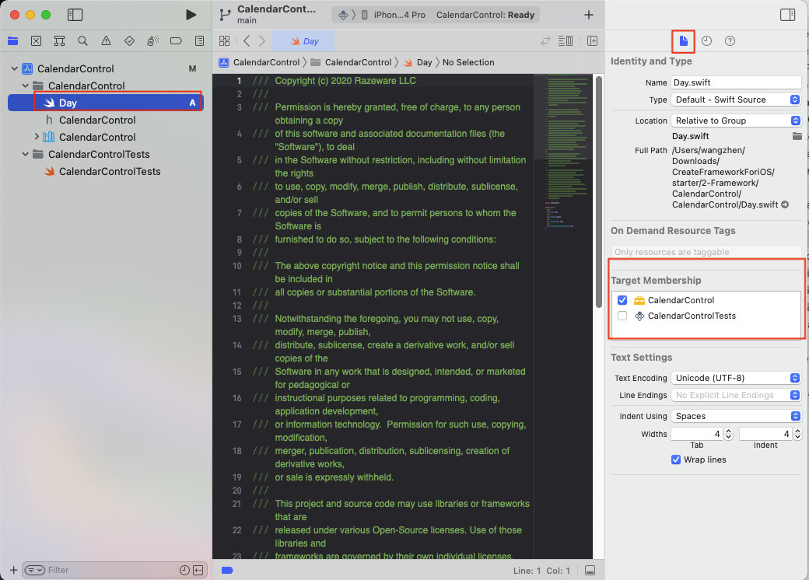
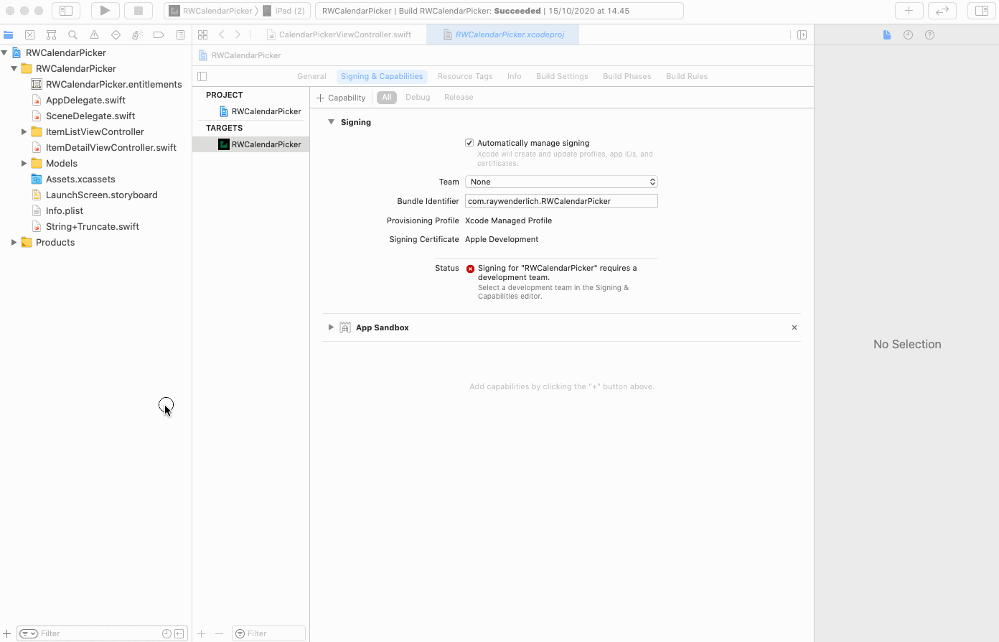
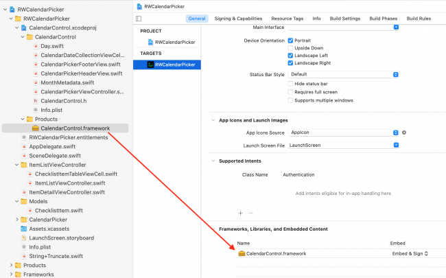
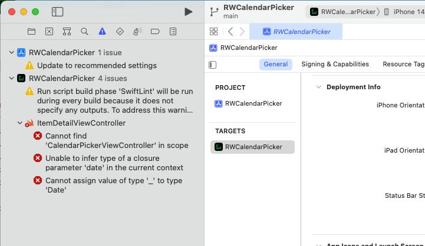
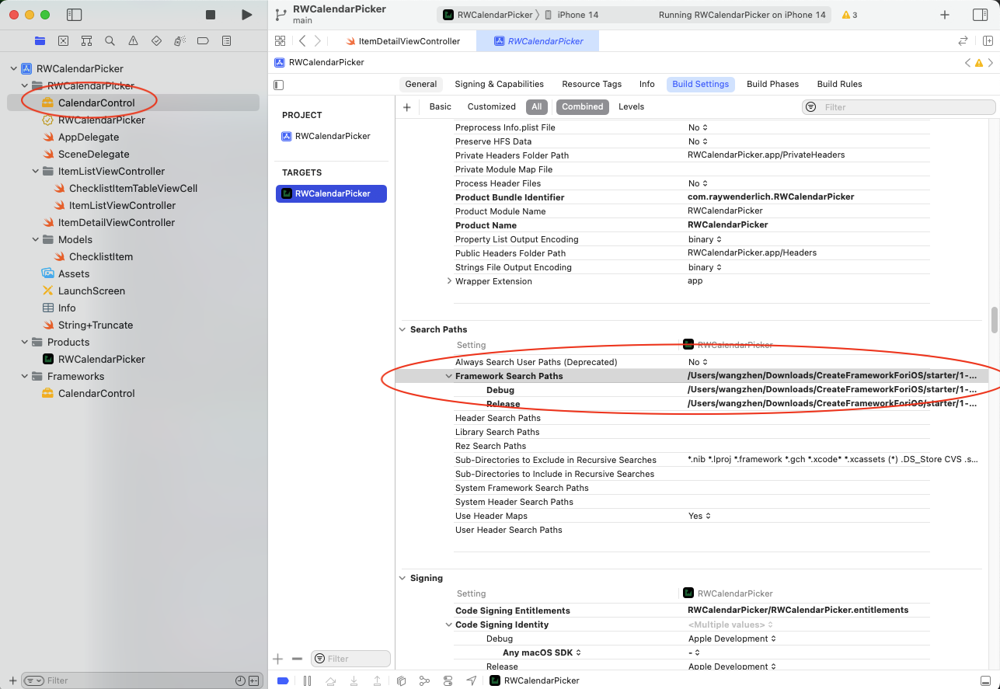
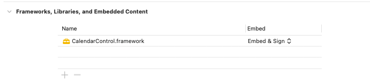

# Creating a Framework for iOS

这次创建Framework的文章参考：

+ [Creating a Framework for iOS](https://www.kodeco.com/17753301-creating-a-framework-for-ios)

## 创建Framework

这篇文章是在已有要共享的类的前提下，创建一个Framework

这次是直接创建一个Framework，*File ▸ New ▸ Project*，选择*iOS ▸ Framework & Library ▸ Framework*

将需要共享的类，从原代码中拖到Framework工程中，确保在*File inspector*中，*Target Membership*对应的是*CalendarControl*（Framework工程）

将*Build Settings*中的*Build Libraries for Distribution*设置为*yes*

## 将Framework添加到Project中

移除原工程中已独立出来的类，然后加入Framework

这里是将`CalendarControl.xcodeproj`作为`RWCalendarPicker.xcodeproj`的子工程

**此步骤在Xcode14中存在问题**

将*CalendarControl.framework* 拖到如下的位置*Frameworks, Libraries and Embedded Content*：

运行，会提示错误：

**You missed an important part of Framework development: Access Control.**

> 默认情况下swift都是`internal`，在自己的module中可见
>
> 将*CalendarPickerViewController*更新为`public`

更改后，但是我在实践中还是发现提示`No such module 'CalendarControl'`

按[Getting error "No such module" using Xcode, but the framework is there](https://stackoverflow.com/questions/29500227/getting-error-no-such-module-using-xcode-but-the-framework-is-there)中的解决办法

设置**Framework Search Paths**后，解决问题

我发现，如果将*CalendarControl.framework*直接拖到工程目录中，会自动设置**Framework Search Paths**

但是要注意修改*Frameworks, Libraries and Embedded Content*中的`Embed`方式

