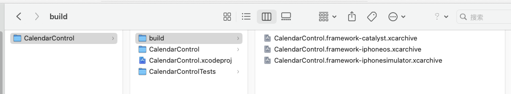
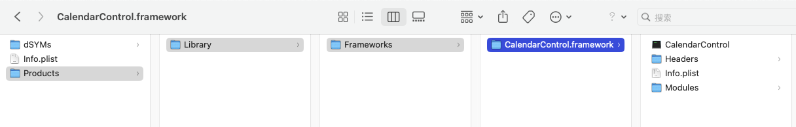
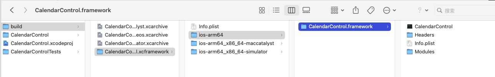
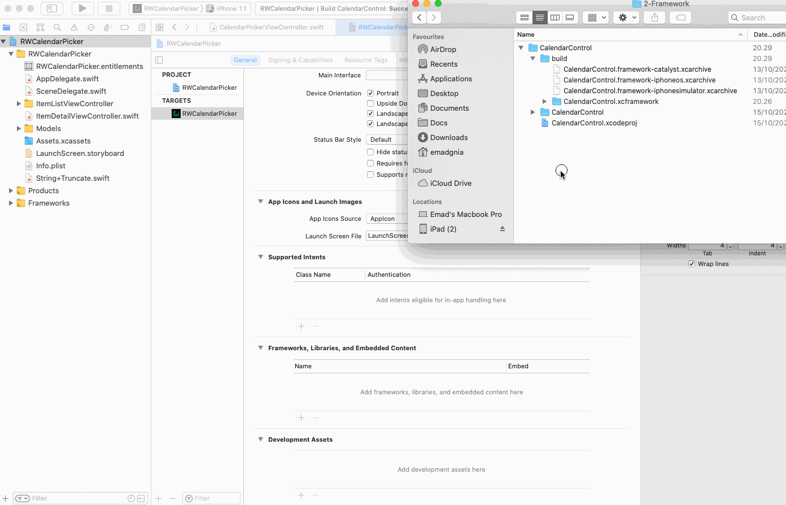

## Publishing the XCFramework

继续参考文章：

+ [Creating a Framework for iOS](https://www.kodeco.com/17753301-creating-a-framework-for-ios)


在终端中切换到工程目录，如：

```shell
cd /Users/xxxx/Downloads/CreateFrameworkForiOS/starter/2-Framework/CalendarControl
```

为如下的三个target归档framework：

+ iOS
+ Simulator
+ macOS


**iOS**

```shell
xcodebuild archive \
-scheme CalendarControl \
-configuration Release \
-destination 'generic/platform=iOS' \
-archivePath './build/CalendarControl.framework-iphoneos.xcarchive' \
SKIP_INSTALL=NO \
BUILD_LIBRARIES_FOR_DISTRIBUTION=YES
```

1. *-scheme CalendarControl*: It’ll use this scheme for archiving.
2. *-configuration Release*: It’ll use the release configuration for building.
3. *-destination ‘generic/platform=iOS’*: This is the architecture type.
4. *-archivePath*: It **saves** archives into this folder path with the given name.
5. *SKIP_INSTALL*: Set *NO* to install the framework to the archive.
6. *BUILD_LIBRARIES_FOR_DISTRIBUTION*: Ensures your libraries are built for distribution and creates the interface file.


**Simulator**

```shell
xcodebuild archive \
-scheme CalendarControl \
-configuration Release \
-destination 'generic/platform=iOS Simulator' \
-archivePath './build/CalendarControl.framework-iphonesimulator.xcarchive' \
SKIP_INSTALL=NO \
BUILD_LIBRARIES_FOR_DISTRIBUTION=YES
```


**macOS**

```
xcodebuild archive \
-scheme CalendarControl \
-configuration Release \
-destination 'platform=macOS,arch=x86_64,variant=Mac Catalyst' \
-archivePath './build/CalendarControl.framework-catalyst.xcarchive' \
SKIP_INSTALL=NO \
BUILD_LIBRARIES_FOR_DISTRIBUTION=YES
```


生成的内容大致如下：



例如`CalendarControl.framework-iphoneos.xcarchive`，显示包内容，大致如下：




**生成XCFramework**

```shell
xcodebuild -create-xcframework \
-framework './build/CalendarControl.framework-iphonesimulator.xcarchive/Products/Library/Frameworks/CalendarControl.framework' \
-framework './build/CalendarControl.framework-iphoneos.xcarchive/Products/Library/Frameworks/CalendarControl.framework' \
-framework './build/CalendarControl.framework-catalyst.xcarchive/Products/Library/Frameworks/CalendarControl.framework' \
-output './build/CalendarControl.xcframework'
```

此命令使用你之前生成的存档将 `XCFramework` 添加到构建文件夹中





将*XCFramework*拖动到*Frameworks, Libraries and Embedded Content* 




