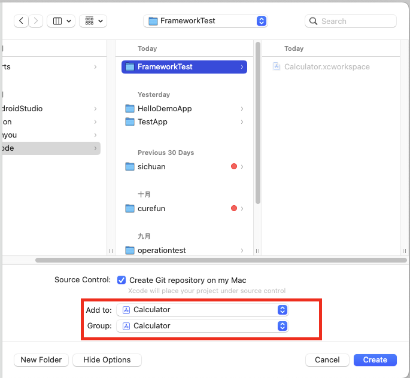
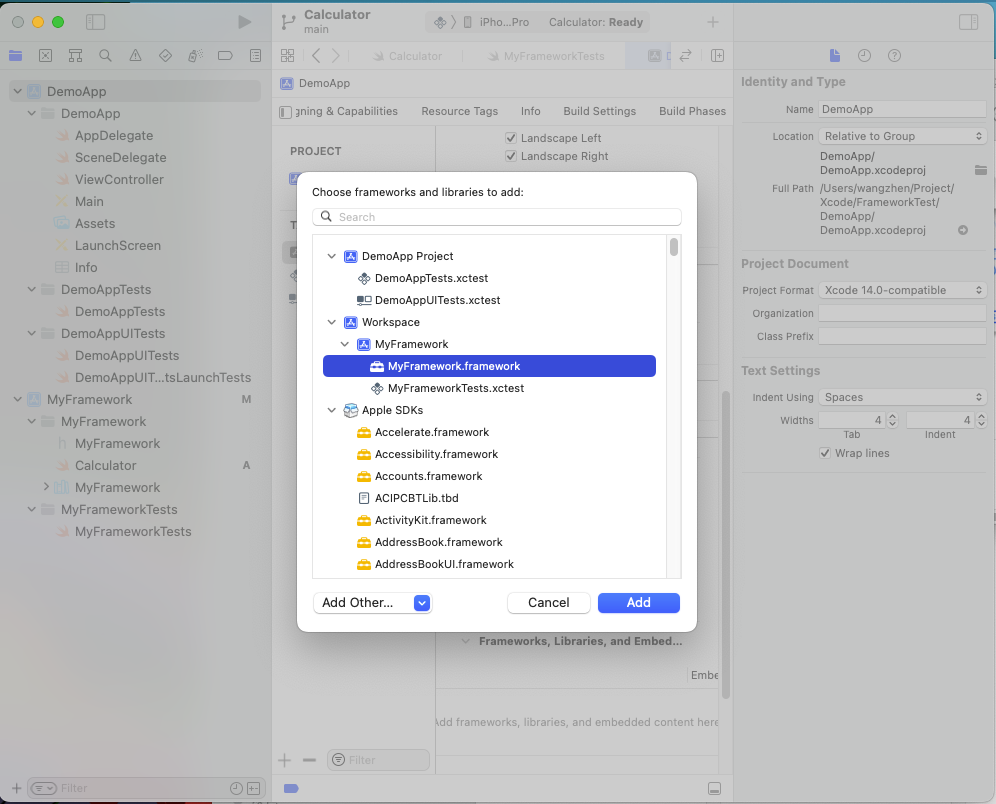

# workspace

参考：

+ [Create, build and link a framework into an iOS project](https://engineering.talkdesk.com/create-build-and-link-a-framework-into-an-ios-project-db05a3a26c63)

这篇文章通过创建workspace的例子来演示Framework

1.先创建**workspace**

2.创建Framework工程，并将工程加入到workspace中

如下：

3.创建Demo工程，和上面基本一致

4.在Demo工程的*General*->*Frameworks, Libraries, and Embedded Content*节，添加Framework

