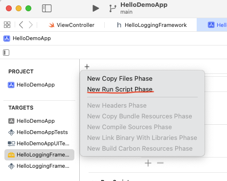
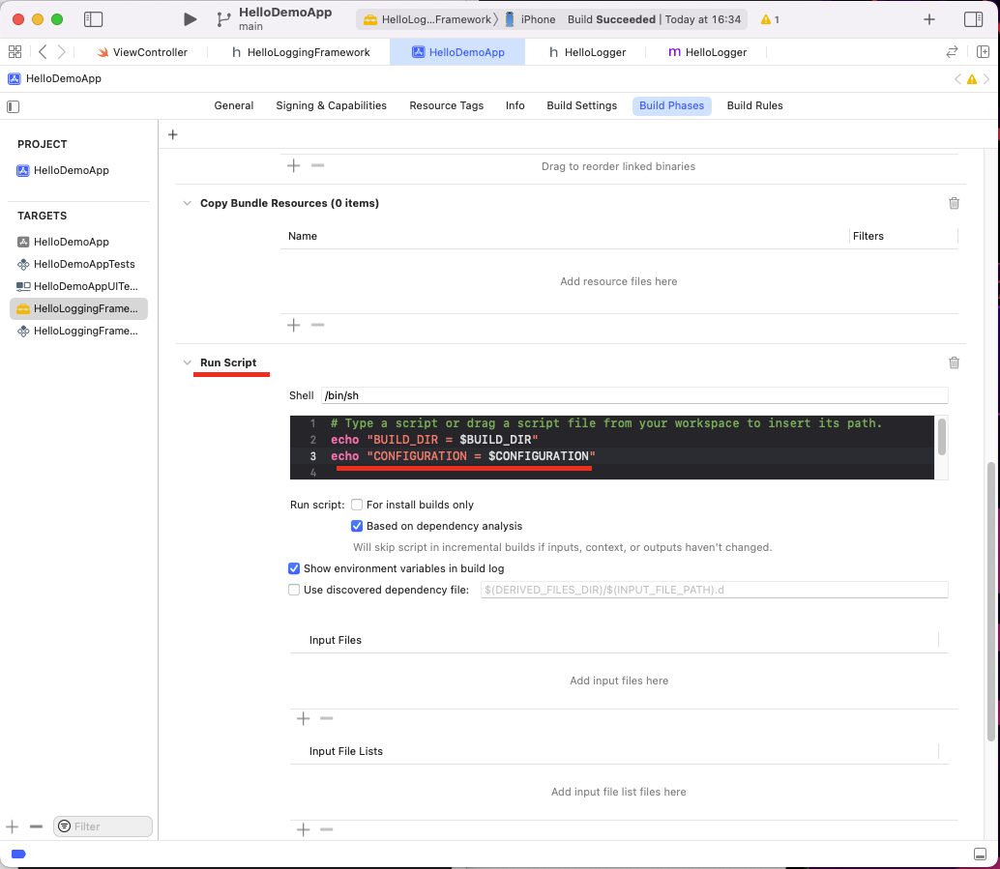
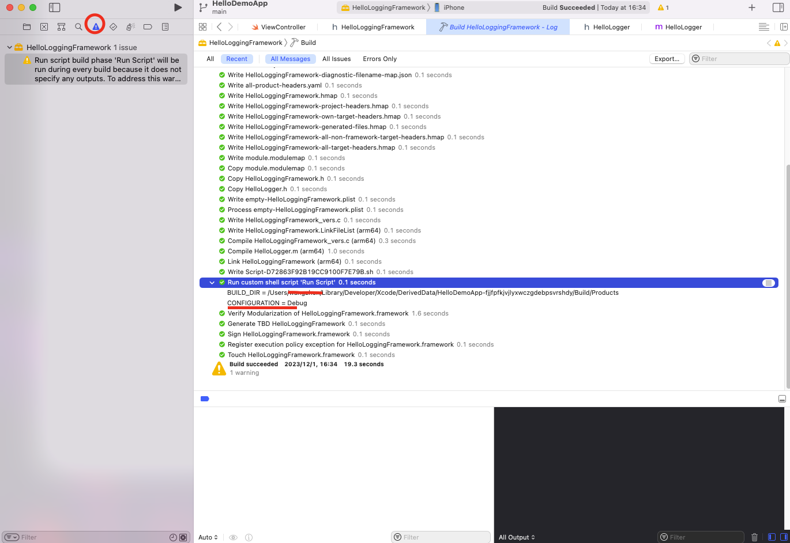
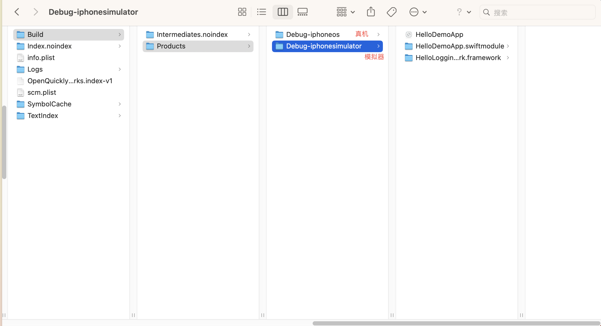

# Build settings

在参考[Creating and Distributing an iOS Binary Framework](https://www.instabug.com/blog/ios-binary-framework)创建Framework中，在创建Script一节，有很多的`${}`的变量，其具体含义是什么呢？

如：`${BUILD_DIR}` 、`${CONFIGURATION}`

如何知道这些具体值是什么？可通过shell脚本打印出来：

1.新建script




2.输出内容




3.build，在左侧的panel，查看输出




## Detail

可参考文档：

+ [Build settings reference](https://developer.apple.com/documentation/xcode/build-settings-reference)

+ [Build Setting Reference](https://developer.apple.com/library/archive/documentation/DeveloperTools/Reference/XcodeBuildSettingRef/1-Build_Setting_Reference/build_setting_ref.html)


### ${BUILD_DIR}

编译文件地址？测试时，输出的路径为:

```shell
BUILD_DIR = /Users/wangzhen/Library/Developer/Xcode/DerivedData/HelloDemoApp-fjjfpfkjvjlyxwczgdebpsvrshdy/Build/Products
```

### ${CONFIGURATION}

大概是Debug 还是 Release

`${BUILD_DIR}`路径下的文件内容，大概如下：




### EFFECTIVE_PLATFORM_NAME

当Target为真机时，其为

```sh
EFFECTIVE_PLATFORM_NAME = -iphoneos
```

为模拟器时：

```sh
EFFECTIVE_PLATFORM_NAME = -iphonesimulator
```


### CONFIGURATION_BUILD_DIR

**每个配置的构建产品路径 (CONFIGURATION_BUILD_DIR)**
在给定配置的构建过程中将放置构建产品的基本路径。 默认情况下，它设置`$(BUILD_DIR)/$(CONFIGURATION)`

```shell
CONFIGURATION_BUILD_DIR = /Users/xxxxx/Library/Developer/Xcode/DerivedData/HelloDemoApp-fjjfpfkjvjlyxwczgdebpsvrshdy/Build/Products/Debug-iphoneos
```

可见：

```sh
$(CONFIGURATION_BUILD_DIR) = $(BUILD_DIR)/$(CONFIGURATION)$(EFFECTIVE_PLATFORM_NAME)
```


