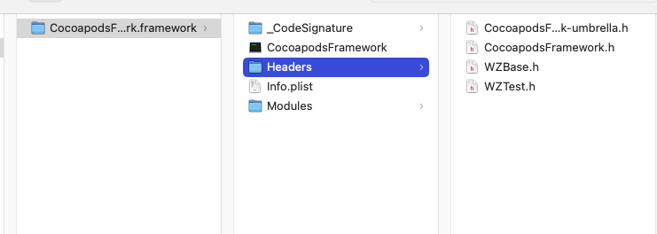

# Cocoapods生成Framework

下面记录下我自己的实践过程，以期对其有深入的理解

## 动态库

按创建Pod的过程

1.`pod lib create CocoapodsFramework`

注意`pod 'CocoapodsFramework', :path => '../'`，指向的是`CocoapodsFramework.podspec`的位置

2.创建要共享的类（模拟，放在`CocoapodsFramework/Classes`目录下）

3.创建一个头文件`CocoapodsFramework.h`，导入其它类头文件

不做任何其它的修改，这时build后，在demo工程中通过`@import CocoapodsFramework;` 或者 `#import <CocoapodsFramework/CocoapodsFramework.h>` 都可以使用Framework中类

### 查看文件格式

生成的Framework如下：

通过file 和 lipo 命令来查看Framework的相关信息

`file ./CocoapodsFramework`

> ./CocoapodsFramework: Mach-O 64-bit dynamically linked shared library arm64

`lipo -info ./CocoapodsFramework `

> Non-fat file: ./CocoapodsFramework is architecture: arm64

