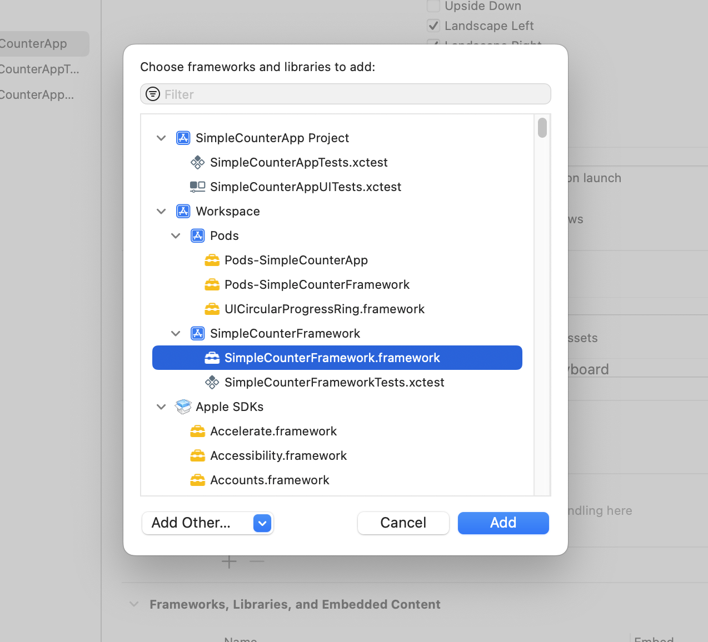
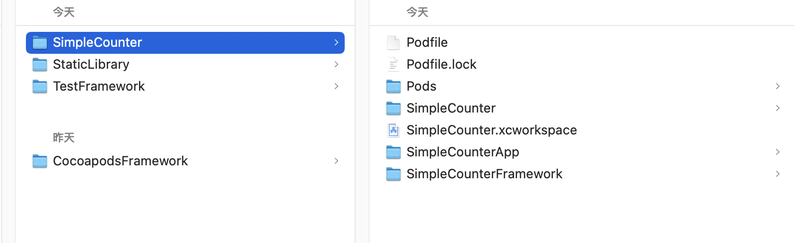

# 另一种形式的Cocoapods生成Framework

这种形式的创建方式，特点在于Podfile

参考：

+ [Improve your iOS team’s productivity by building features as frameworks](https://truffle-bot.medium.com/improve-your-ios-teams-productivity-by-building-features-as-frameworks-9d2a64cbcab5)
+ [How to use CocoaPods with your internal iOS frameworks](https://truffle-bot.medium.com/how-to-use-cocoapods-with-your-internal-ios-frameworks-192aa472f64b)

创建方式和这类似的博客：

+ [iOS - framework制作|CocoaPods部署- (1)framework制作](https://juejin.cn/post/6873751337813835790?from=search-suggest)


其步骤大致如下：

1.创建workspace

2.创建一个DemoApp和一个Framework，都添加到workspace中

3.DemoApp依赖Framework




之后，为工程添加pod依赖，创建Podfile，其目录结构如下：




Podfile的内容如下：

```ruby
source 'https://github.com/CocoaPods/Specs.git'

platform :ios, '13.0'

use_frameworks!

workspace 'SimpleCounter.xcworkspace'

target 'SimpleCounterApp' do
  # Comment the next line if you don't want to use dynamic frameworks
  # use_frameworks!

  # Pods for TestFramework
  
  project './SimpleCounterApp/SimpleCounterApp.xcodeproj'
  pod 'UICircularProgressRing', '6.1.0'

end

target 'SimpleCounterFramework' do
    project './SimpleCounterFramework/SimpleCounterFramework.xcodeproj'
    pod 'UICircularProgressRing', '6.1.0'
end

```

这里指定了`workspace`


代码位置：[SimpleCounter](https://github.com/winfredzen/iOS-Basic/tree/master/Framewrok/code/SimpleCounter)


