# Library

内容参考自：

+ [iOS Deep Understanding of Libraries and Frameworks](https://www.youtube.com/watch?v=lGG0UPdvc54&t=695s)

**什么是Library？**

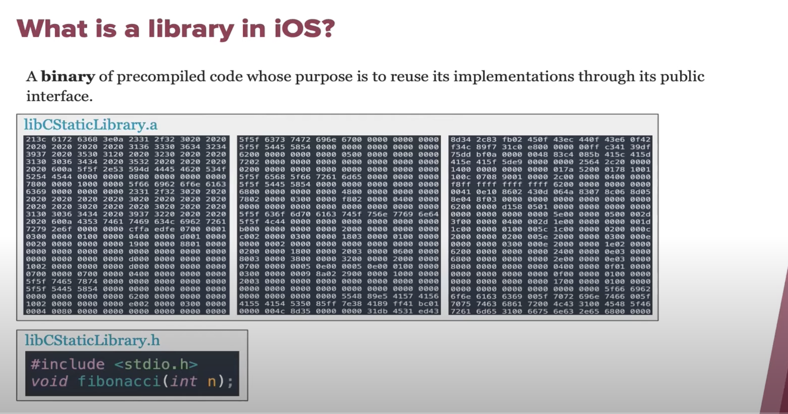


**Library的类型**

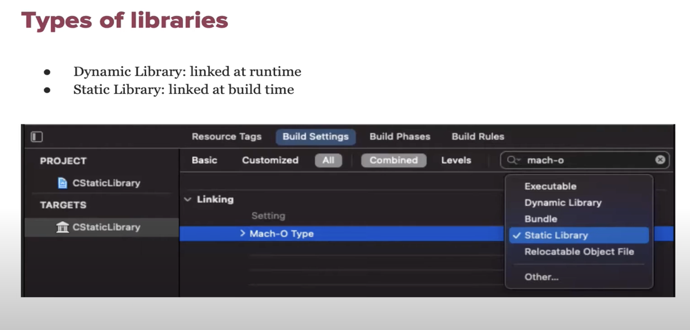


**创建C Library**

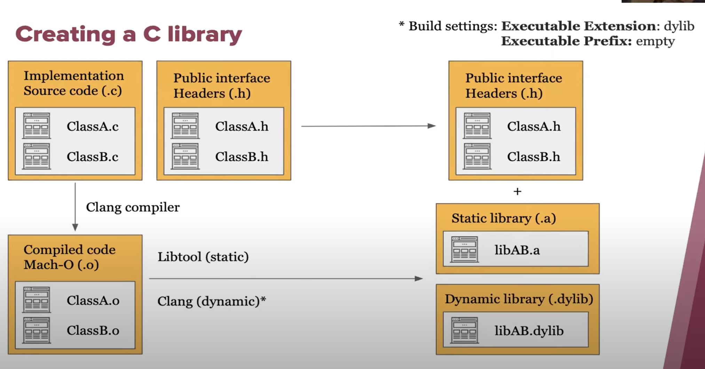


**创建C++ Library**


**创建Objective-C 库**

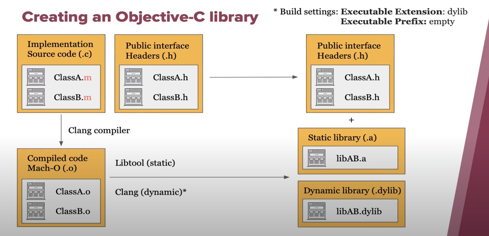


## 创建静态库

1.File-> New -> Project -> Static Library

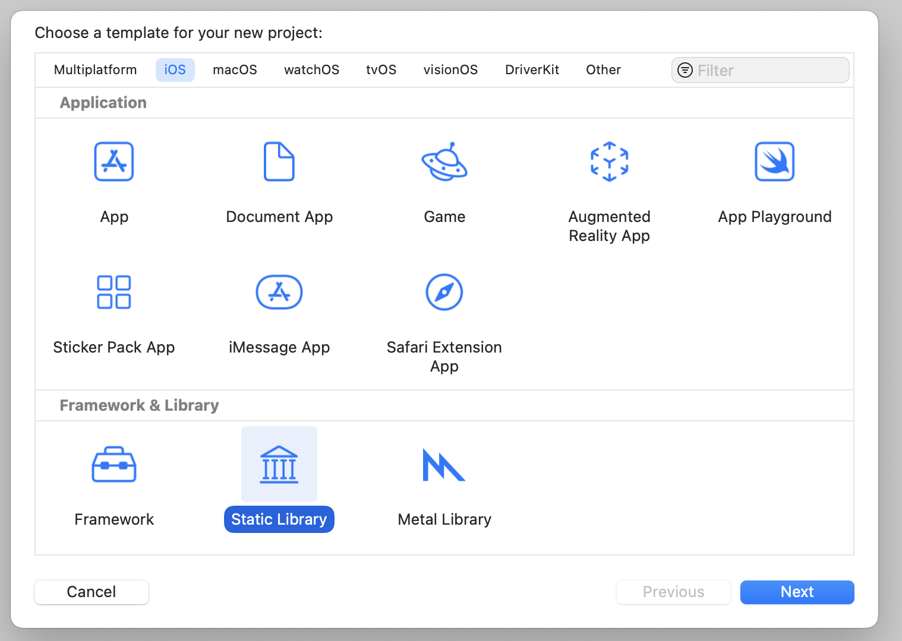


2.选择Mach-o Type为Static Library

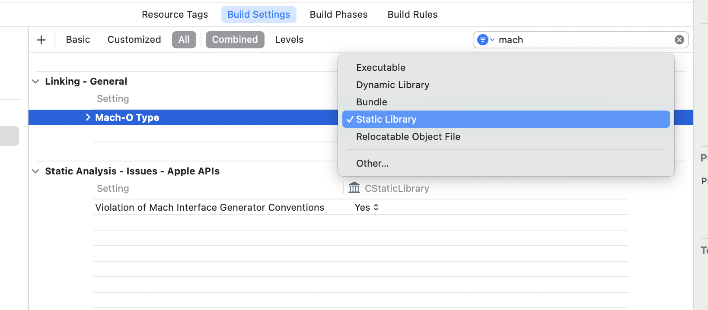


3.Skip install -> NO

为啥这样做？想要的distribute in release mode，使用archive。如果设置为yes的话，在archive时Library不会被copy

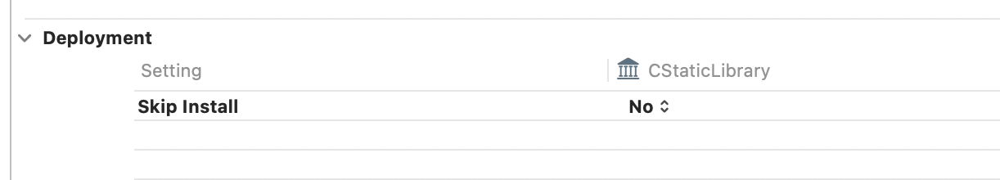


4.将`BUILD_LIBRARY_FOR_DISTRIBUTION`设置为yes。（针对Swift开发的库）

其作用：

> 确保您的库是为分发而构建的。 对于 Swift，这可以支持库的演变和模块接口文件的生成。


5`.Product->Archive`

选择Distribute Content

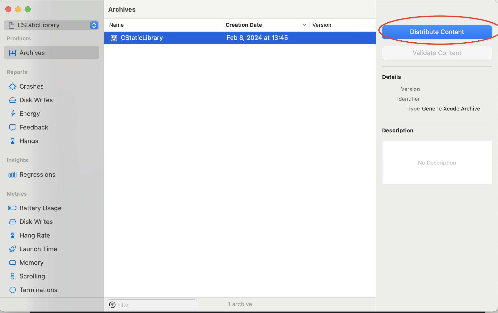

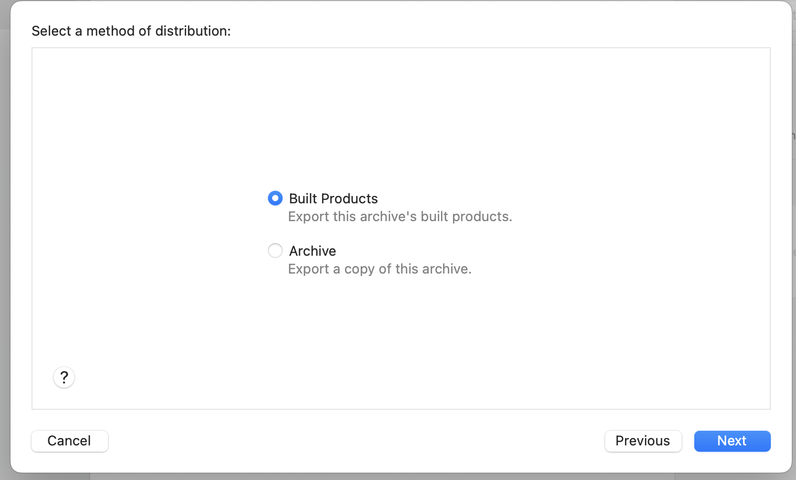


导出文件如下：

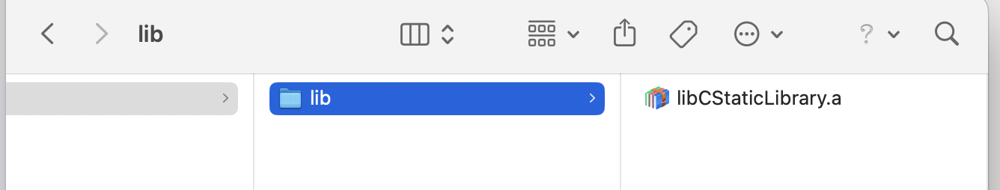


**6.Shell工具的使用**

`ar -xv <library path>`从静态库中抽取mach-o

如：

```shell
ar -xv /Users/wangzhen/Desktop/CStaticLibrary\ 2024-02-08\ 13-49-33/Products/usr/local/lib/libCStaticLibrary.a
```

效果如下：

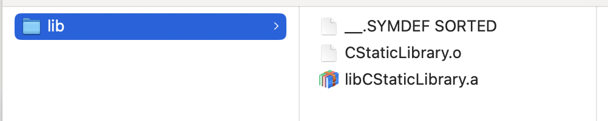


## Link链接


