# Shell生成Library

内容参考自：

+ [iOS Deep Understanding of Libraries and Frameworks](https://www.youtube.com/watch?v=lGG0UPdvc54&t=695s)

其原代码位置是：

+ [libraries-and-frameworks-course](https://github.com/lu15gv/libraries-and-frameworks-course)

一些说明：

+ [iOS-libraries-cheat-sheet](https://github.com/lu15gv/iOS-libraries-cheat-sheet)


还是参考上面的视频内容，通过shell生成Library，如`buildC.sh`的内容：

```shell
#!/bin/bash

set -e

BASEDIR=$(dirname "$0")
PROJECT_NAME="CStaticLibrary"
PROJECT_PATH="$BASEDIR/$PROJECT_NAME/$PROJECT_NAME.xcodeproj"
DERIVED_DATA_PATH="$BASEDIR/.derivedData/$PROJECT_NAME"
ARCHIVE_PATH="$DERIVED_DATA_PATH/archives/$PROJECT_NAME/$PROJECT_NAME.xcarchive"
PRODUCTS_PATH="$BASEDIR/product"

echo "BASEDIR =  $BASEDIR"

echo_section() {
  SECTION=$1
  echo "\033[1;34m ********************************* $SECTION ********************************** \033[0m" 
}

archive() {
  PROJECT=$1
  SCHEME=$2
  CONFIGURATION=$3
  SDK=$4
  ARCH=$5
  xcodebuild archive \
  -project $PROJECT \
  -scheme $SCHEME \
  -derivedDataPath $DERIVED_DATA_PATH \
  -archivePath $ARCHIVE_PATH \
  -configuration $CONFIGURATION \
  -sdk $SDK \
  -arch $ARCH \
  MACH_O_TYPE=staticlib \
  SKIP_INSTALL=NO | xcbeautify
}

echo_section "Cleaning: C"

rm -rf "$PRODUCTS_PATH/$PROJECT_NAME"
rm -rf "$DERIVED_DATA_PATH/$PROJECT_NAME"

mkdir -p "$PRODUCTS_PATH/$PROJECT_NAME"
mkdir -p "$DERIVED_DATA_PATH/$PROJECT_NAME"

echo_section "Archiving: C"

archive $PROJECT_PATH $PROJECT_NAME "Release" "iphonesimulator" "x86_64"

echo_section "Copying files: C"

cp "$ARCHIVE_PATH/Products/usr/local/lib/lib$PROJECT_NAME.a" "$PRODUCTS_PATH/$PROJECT_NAME/lib$PROJECT_NAME.a"
cp "$BASEDIR/$PROJECT_NAME/$PROJECT_NAME/$PROJECT_NAME.h" "$PRODUCTS_PATH/$PROJECT_NAME/$PROJECT_NAME.h"

echo_section "Done: C"
```


一些我自己的理解：

1.要安装`xcbeautify`，否则提示出错

```sh
brew install xcbeautify
```

2.一些变量的理解：

`dirname "$0"`取得当前执行的脚本文件的父目录

`$(dirname "$0")`表示执行上面的这个命令

目录结构如下：

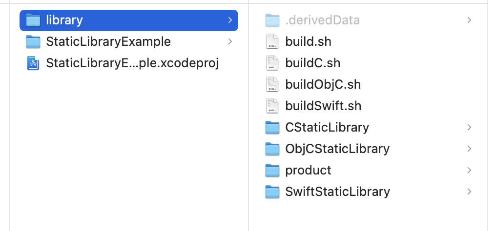


所以`BASEDIR`的路径为：`/Users/wangzhen/Documents/GitHub/libraries-and-frameworks-course/1_C_Static_Library/library`


`DERIVED_DATA_PATH`应该指的是构建成功时相关的缓存文件路径

最主要的还是用到了`xcodebuild`


生成的Product如下：

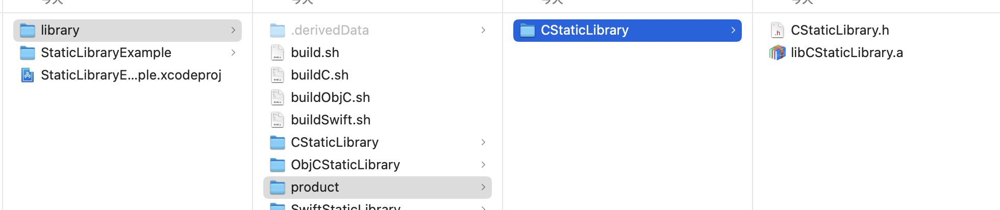


通过`nm`命令打印symbols of a binary，`nm <binary path>`

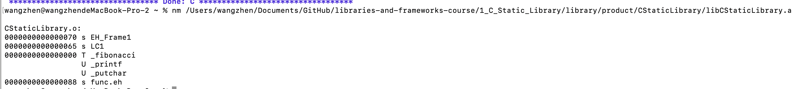


## 使用Library

在一个swift工程中使用上面创建的C Library，先做一些设置

先看下这个整个项目的目录

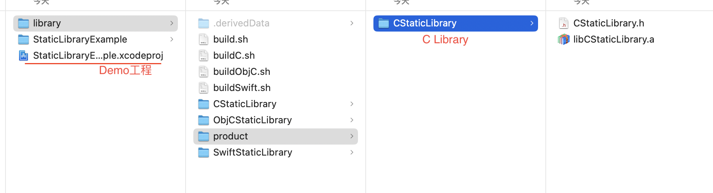


**1.Header Search Paths**

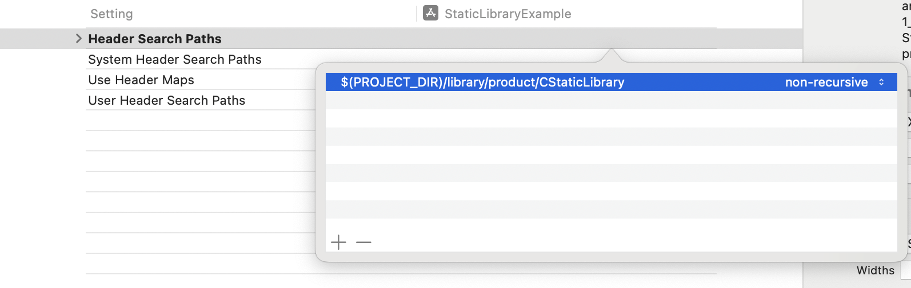


在Bridge Header中导入头文件`\#include "CStaticLibrary.h"`，此时Build就不会报错了

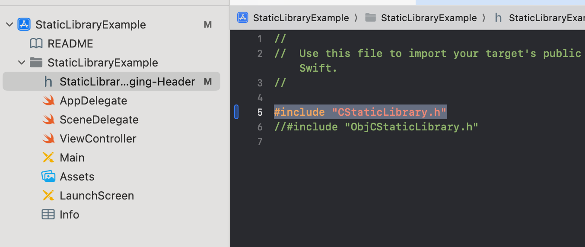


此时如果直接调用库中的函数，则fail，如下：

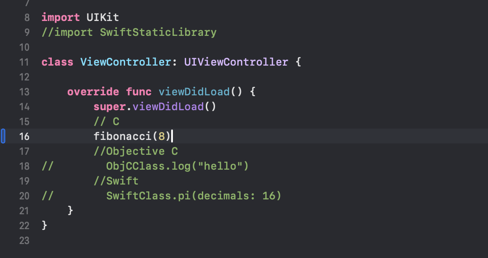

显示Link失败

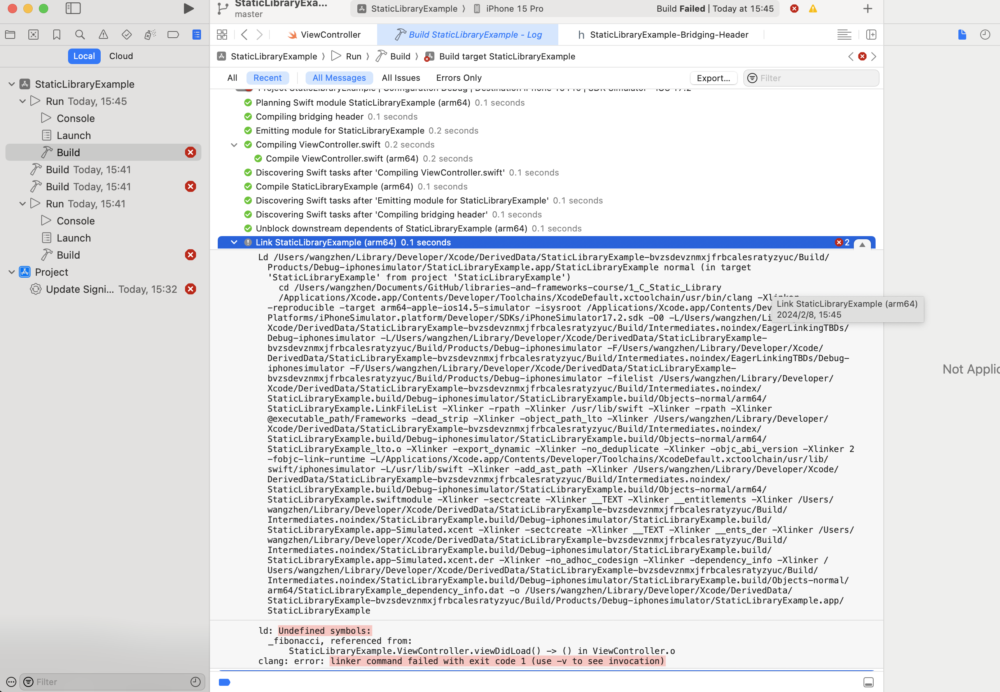


**2.Libaray Search Paths**

设置Libaray Search Paths，如下：

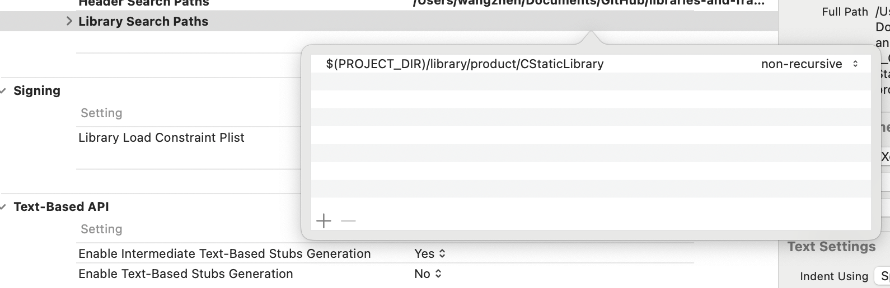

此时如果build，还是一样的报错


**注意**

由于上面生成的是x86_64架构下的库，但本人电脑是M2，是arm架构的，所以，会有如下的出错：

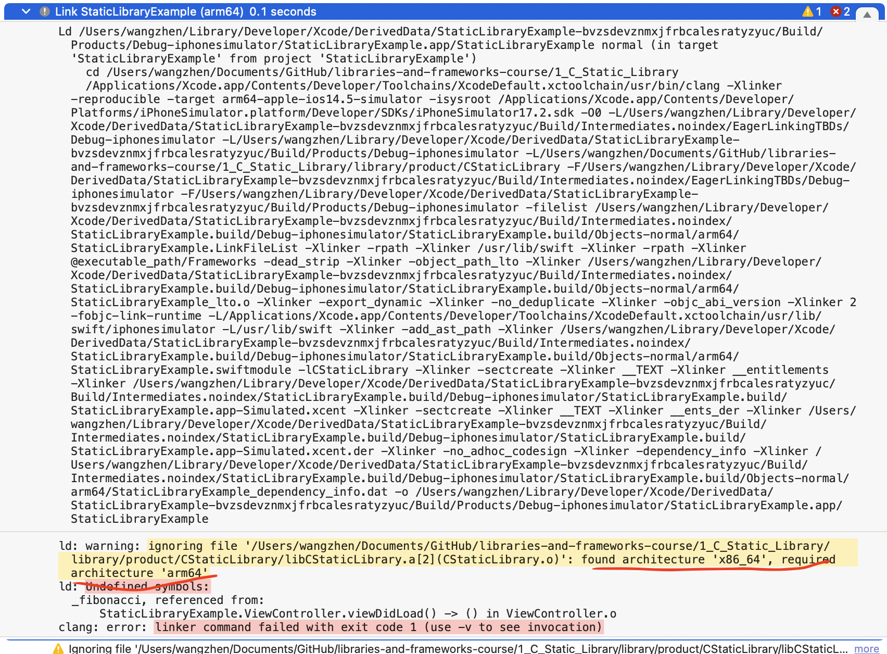


修改sh文件中的架构，重新生成


**3.Other Linker Flag**

在Other Linker Flag中设置为`-lCStaticLibrary`

> 库名称为`libCStaticLibrary`，去掉前面的`lib`，添加`-l`

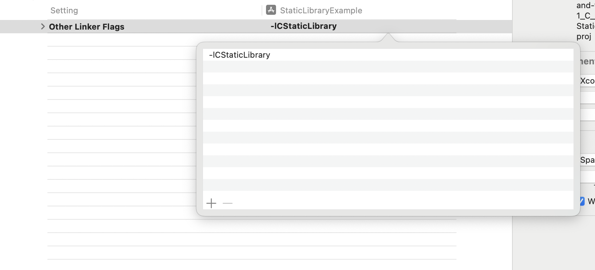


> 为什么有这个`-l`？
>
> 在网上查了下，没找到具体的说明：
>
> + [linker-flags](https://releases.llvm.org/14.0.0/tools/clang/docs/ClangCommandLineReference.html#linker-flags)
>
> 如在[c++ linker flag](https://juejin.cn/s/c%2B%2B%20linker%20flag)中的描述：`-l<库名>`：指定链接器需要链接的库名。例如，`-lm`表示链接`math`库。


至此就OK了


