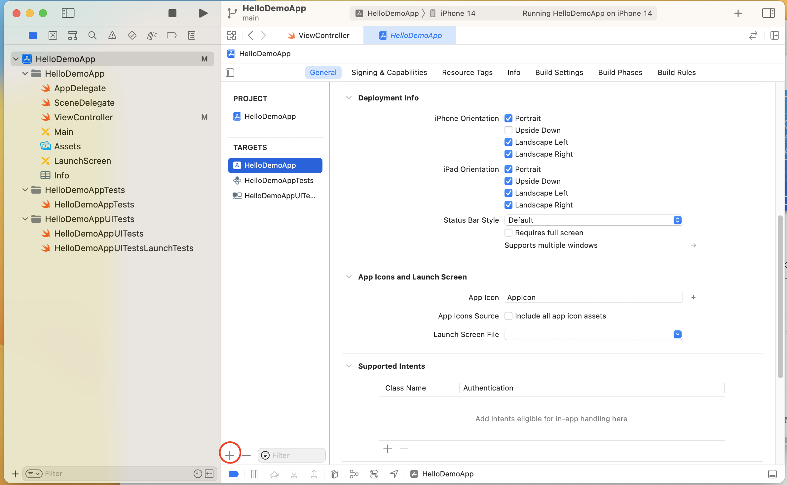
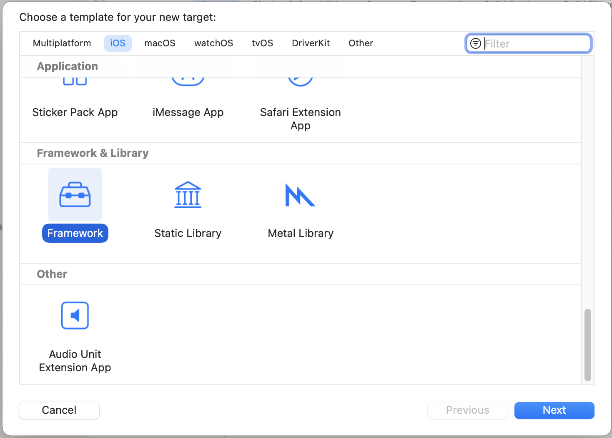
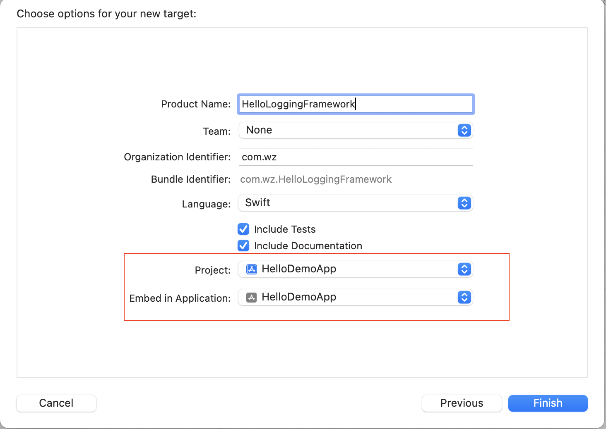
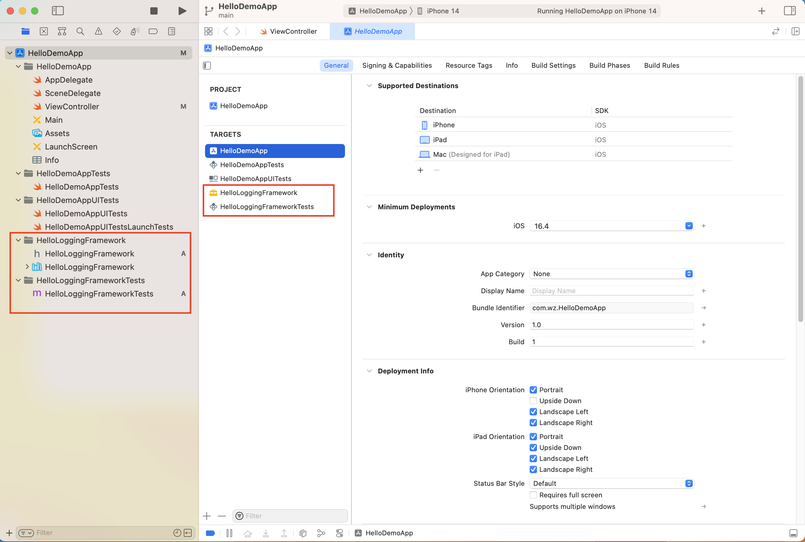
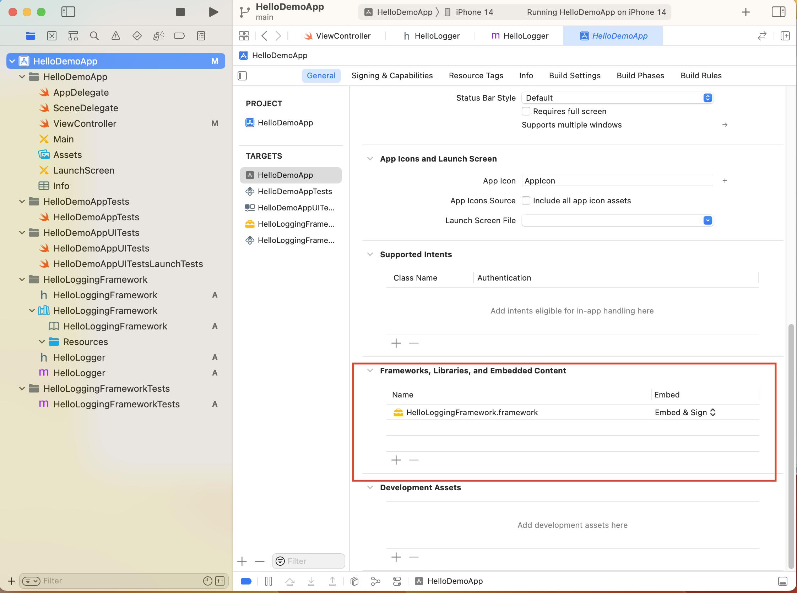
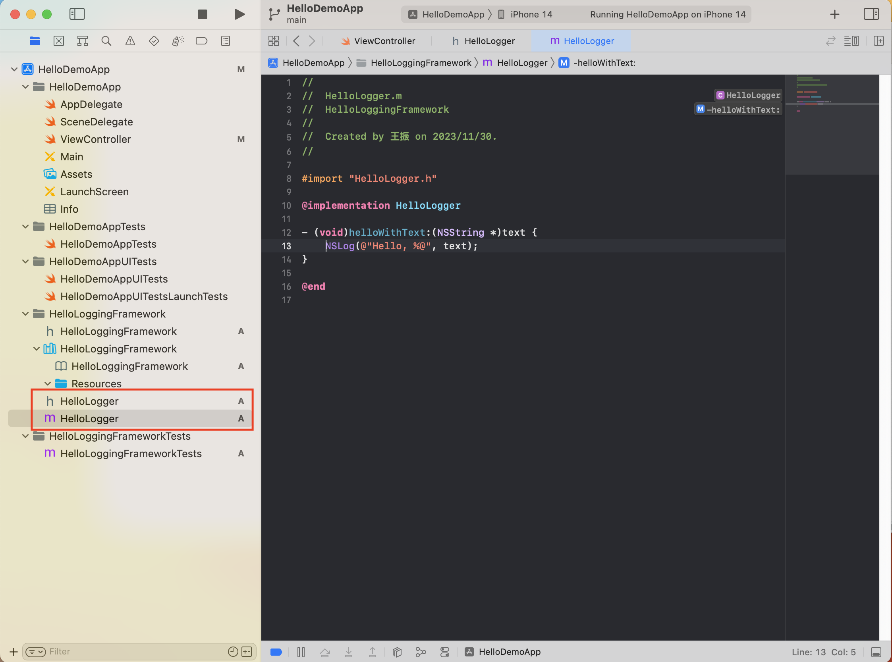
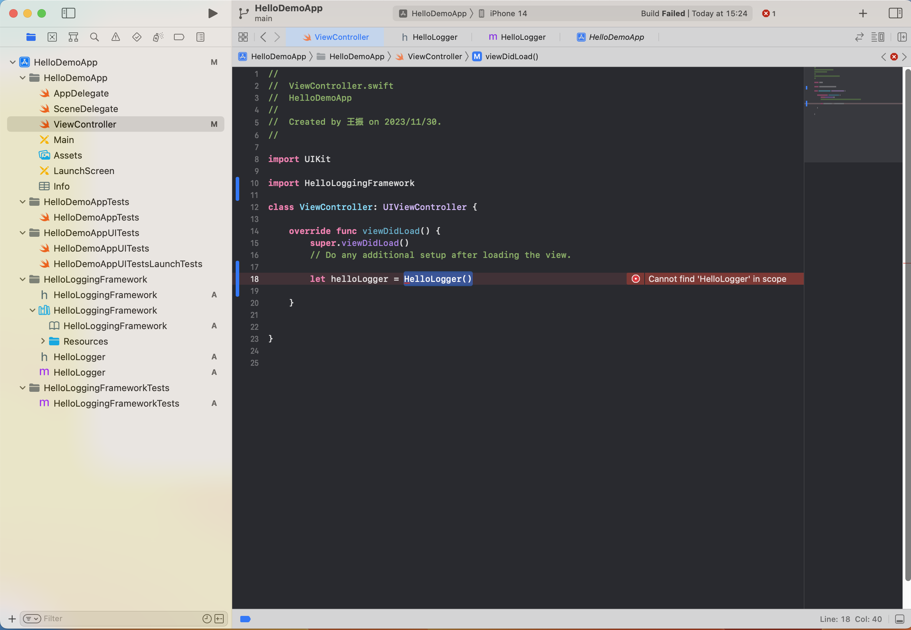
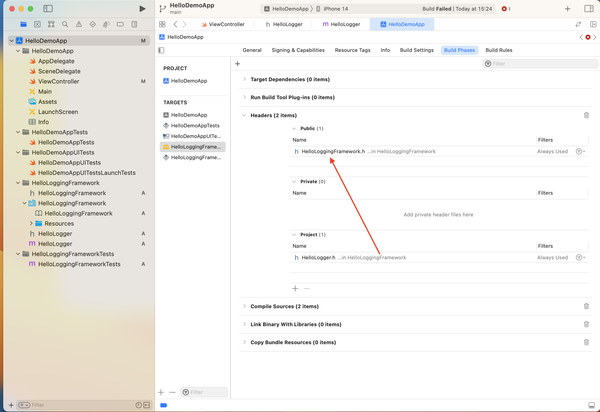
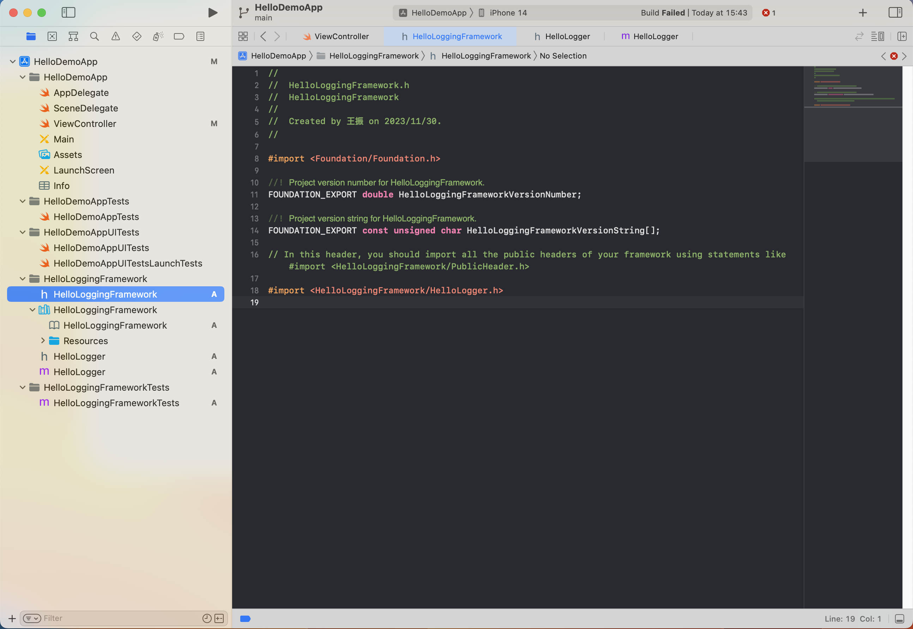

# 创建Framework

如何创建Framework，我参考如下的文章：

+ [Creating and Distributing an iOS Binary Framework](https://www.instabug.com/blog/ios-binary-framework)

记录过程如下：

1.想创建Demo App，此App是用来使用Framework的

**2.创建Binary Framework**

步骤如下：

a.在Demo App的Target下，新建一个新的Target



选择Framework



创建选项如下：



创建后工程中多出如下的内容：




创建后，会发现Demo Target中的`Frameworks, Libraries, and Embedded Content`，会增加如下的内容：




b.在Framework中添加功能

这里添加一个日志输出类`HelloLogger`




此时，如果在Demo App中导入`HelloLoggingFramework`，并使用`HelloLogger`类，会提示`Cannot find 'HelloLogger' in scope`




**为什么呢？**

> That’s because any class you create in a binary framework by default has access scope to `Project`, which isn’t accessible outside that target. To fix this: **Make your class public**
>
> 这是因为默认情况下，您在二进制框架中创建的任何类都具有 `Project` 的访问范围，而在该目标之外无法访问该范围。 要解决此问题：将您的类设为公开




修改运行，还是提示`Cannot find 'HelloLogger' in scope`

再修改**HelloLoggingFramework.h**，其中有如下的说明：

```objc
// In this header, you should import all the public headers of your framework using statements like #import <HelloLoggingFramework/PublicHeader.h>
```

> `HelloLoggingFramework/PublicHeader.h` is what’s called an “`umbrella header`” of your binary framework. It’s your interface with the outside world and it dictates that to expose any class, you need to import its header there.
>
> `HelloLoggingFramework/PublicHeader.h` 是二进制框架的所谓“umbrella header”。 它是您与外界的接口，它规定要公开任何类，您需要在那里导入其header。




此时就可以正常使用了


