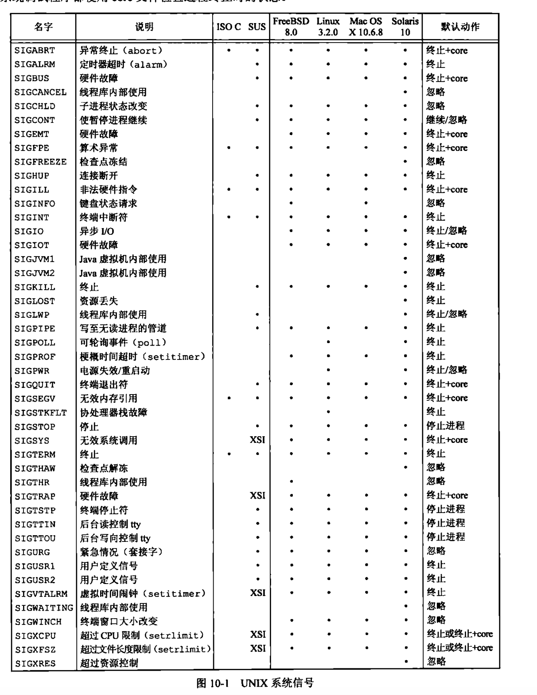

# signal

内容来自《Unix环境高级编程》

> 信号（signal）用于通知进程发生了某种情况。如，某一进程执行除法操作，其除数为0，则将名为`SIGFPE`（浮点异常）的信号发送给该进程。进程有3中处理信号的方式：
>
> 1. 忽略信号
> 2. 按系统默认方式处理。对于除数为0，系统默认方式是终止该进程
> 3. 提供一个函数，信号发生时调用该函数，被称为捕捉该信号。

> 信号时软件中断


> 每个信号都有一个名字，以`SIG`开头





## 函数signal

Unix系统信号机制最简单的接口是`signal`函数

```c
void (*signal(int signo, void (*func)(int)))(int);
```

+ `signo` - 信号名

+ `func` - 可以是常亮`SIG_IGN`、`SIG_DFL`，或者接到此信号后要调用的函数的地址。

  > `SIG_IGN` - 向内核表示忽略此信号
  >
  > `SIG_DFL` - 表示接到此信号后的动作是系统默认动作
  >
  > 指定函数地址 - 在信号发生时，调用该函数，这种处理为捕捉该信号


> signal函数原型说明此函数要求两个参数，返回一个函数指针，而该指针所指向的函数无返回值（void）
>
> 第一个参数*signo*是一个整型数
>
> 第二个参数是函数指针，它所指向的函数需要一个整型参数，无返回值


