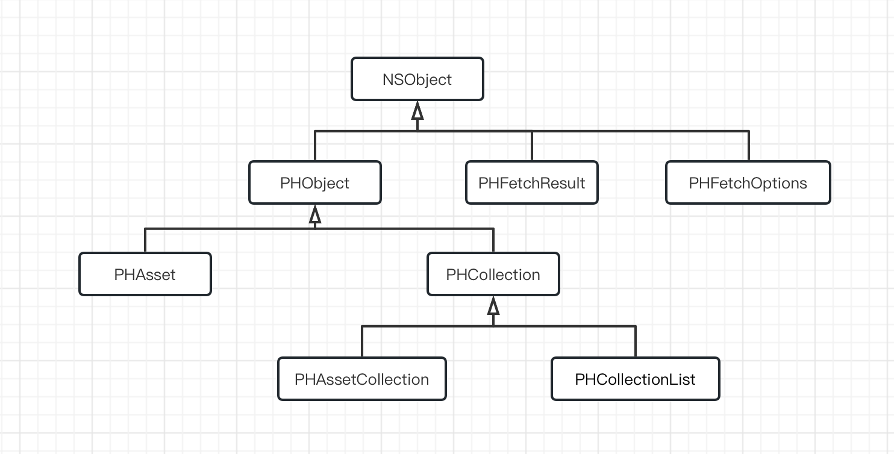

# PhotoKit

最权威的文档当然是官方文档了，[PhotoKit](https://developer.apple.com/documentation/photokit)

推荐教程：

+ [Getting Started with PhotoKit](https://www.kodeco.com/11764166-getting-started-with-photokit)


## 相关类介绍




### PHAsset

[PHAsset](https://developer.apple.com/documentation/photokit/phasset) 表示： A representation of an image, video, or Live Photo in the Photos library.

继承自[`PHObject`](https://developer.apple.com/documentation/photokit/phobject)

```swift
class PHAsset : PHObject
```

1.Asset只包含元数据（**metadata**）。Asset对应的image或者video数据，可能没有存储在本地设备上。根据我们使用的场景，也许不需要下载这些数据。如果使用缩率图来填充CollectionView，Photos framework 可为每个asset管理下载、生成、缓存缩率图。具体的细节，可参考[`PHImageManager`](https://developer.apple.com/documentation/photokit/phimagemanager)

2.Asset对象是不可变的。为编辑元数据（例如将photo标记为最爱），可使用photo library change block创建一个[`PHAssetChangeRequest`](https://developer.apple.com/documentation/photokit/phassetchangerequest)


### PHAssetCollection

[PHAssetCollection](https://developer.apple.com/documentation/photokit/phassetcollection)表示照片asset分组的形式，例如时刻、用户创建的相册或智能相册

与assets和collection lists一样，asset collections是不可变的。 要创建、重命名或删除asset collection，或者添加、删除或重新排列asset collection中的成员，请在照片库更改块中创建 `PHAssetCollectionChangeRequest` 对象


### PHFetchResult

[PHFetchResult](https://developer.apple.com/documentation/photokit/phfetchresult)表示从Photos获取方法返回的assets或collections的有序列表。


### PHFetchOptions

[PHFetchOptions](https://developer.apple.com/documentation/photokit/phfetchoptions)表示：一组选项，这些选项会影响在获取asset或collection对象时Photos返回的结果的筛选、排序和管理。


## 使用

可参考：

+ [Browsing and Modifying Photo Albums](https://developer.apple.com/documentation/photokit/browsing_and_modifying_photo_albums)

其示例中的代码很有参考意义，下载地址[download](https://docs-assets.developer.apple.com/published/ea323a0aa7/BrowsingAndModifyingPhotoAlbums.zip)


