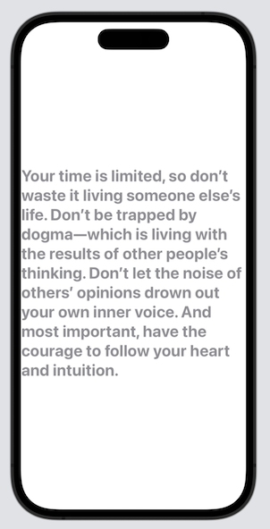
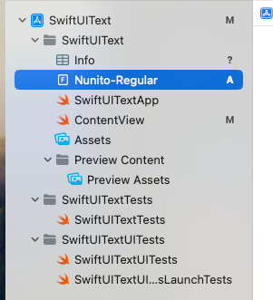

# Text

显示简单的文本，如：

```swift
import SwiftUI

struct ContentView: View {
    var body: some View {
        Text("Stay Hungry. Stay Foolish.")
    }
}

#Preview {
    ContentView()
}
```


## 修改Font和Color

如设置font为粗体，font为系统内置`.title`：

```swift
        Text("Stay Hungry. Stay Foolish.")
            .fontWeight(.bold)
            .font(.title)
```

设置font to be rounded：

```swift
        Text("Stay Hungry. Stay Foolish.")
            .fontWeight(.bold)
            .font(.system(.title, design: .rounded))
```


使用固定大小的font

```swift
        Text("Stay Hungry. Stay Foolish.")
            .font(.system(size: 20))
```


使用`foregroundColor`设置颜色

```swift
        Text("Stay Hungry. Stay Foolish.")
            .font(.system(size: 20))
            .foregroundColor(.green)
```


## 多行文本

如：

```swift
        Text("Your time is limited, so don’t waste it living someone else’s life. Don’t be trapped by dogma—which is living with the results of other people’s thinking. Don’t let the noise of others’ opinions drown out your own inner voice. And most important, have the courage to follow your heart and intuition.")
            .fontWeight(.bold)
            .font(.title)
            .foregroundColor(.gray)
```



居中对齐

```swift
.multilineTextAlignment(.center)
```


限制行数

```swift
.lineLimit(3)
```


`truncationMode`设置如何截断text

```swift
struct ContentView: View {
    var body: some View {
        Text("Your time is limited, so don’t waste it living someone else’s life. Don’t be trapped by dogma—which is living with the results of other people’s thinking. Don’t let the noise of others’ opinions drown out your own inner voice. And most important, have the courage to follow your heart and intuition.")
            .fontWeight(.bold)
            .font(.title)
            .foregroundColor(.gray)
            .multilineTextAlignment(.center)
            .lineLimit(3)
            .truncationMode(.head)
    }
}
```


## 设置Padding和Line Spacing

`lineSpacing`设置Line Spacing

`padding()`设置padding

```swift
        Text("Your time is limited, so don’t waste it living someone else’s life. Don’t be trapped by dogma—which is living with the results of other people’s thinking. Don’t let the noise of others’ opinions drown out your own inner voice. And most important, have the courage to follow your heart and intuition.")
            .fontWeight(.bold)
            .font(.title)
            .foregroundColor(.gray)
            .multilineTextAlignment(.center)
            .lineSpacing(10)
            .padding()
```


## 旋转Text

```swift
.rotationEffect(.degrees(45))
```


默认情况下是围绕中心点旋转。如果需要围绕一个特定点旋转，如下：

```swift
.rotationEffect(.degrees(30), anchor: UnitPoint(x: 0, y: 0))
```


使用`rotation3DEffect` 来进行3D旋转

```swift
.rotation3DEffect(.degrees(60), axis: (x: 1.0, y: 0, z: 0))
```


还可以通过如下的代码，设置阴影效果：

```swift
.shadow(color: .gray, radius: 2, x: 0, y: 15)
```


## 自定义字体

1.先将自定义字体拖到项目中



2.在info中注册


3.使用

```swift
.font(.custom("Nunito", size: 25))
```


## 显示Markdown

SwiftUI支持渲染Markdown

如：

```swift
        Text("**This is how you bold a text**. *This is how you make text italic.* You can [click this link](https://www.appcoda.com) to go to appcoda.com")
        .font(.title)
```


## 代码

[SwiftUIText](https://github.com/winfredzen/iOS-Basic/tree/master/SwiftUI/code/SwiftUIText)


