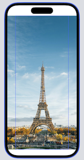

# Image


## 系统图片

[SF Symbols](https://developer.apple.com/sf-symbols/)相当于是系统提供的图标字体

显示系统图片，使用如下的方式：

```swift
Image(systemName: "cloud.heavyrain")
```

也可以为其指定font大小，对其进行缩放

```swift
        Image(systemName: "cloud.heavyrain")
            .font(.system(size: 100))
```


系统图片其实是font，所以可以改变其外观，如设置颜色和阴影

```swift
        Image(systemName: "cloud.heavyrain")
            .font(.system(size: 100))
            .foregroundColor(.blue)
            .shadow(color: .gray, radius: 10, x: 0, y: 10)
```


## 使用自己的图片

将图片加入到`Assets`后可直接使用

如：

```swift
Image("paris")
```

> paris图片的分辨率为`4437x6656`， 所以只能看见一部分


### 调整图像大小

```swift
    /// Sets the mode by which SwiftUI resizes an image to fit its space.
    /// - Parameters:
    ///   - capInsets: Inset values that indicate a portion of the image that
    ///   SwiftUI doesn't resize.
    ///   - resizingMode: The mode by which SwiftUI resizes the image.
    /// - Returns: An image, with the new resizing behavior set.
    public func resizable(capInsets: EdgeInsets = EdgeInsets(), resizingMode: Image.ResizingMode = .stretch) -> Image
```

`resizable`默认使用的是`.stretch`模式（缩放来填充整个屏幕，除去顶部和底部的区域）

```swift
        Image("paris")
            .resizable()
```


如果想显示一个全屏的图片，使用`ignoresSafeArea` 

```swift
        Image("paris")
            .resizable()
            .ignoresSafeArea()
```


还可以选择忽略**特定边缘的安全区域**。 如：

```swift
        Image("paris")
            .resizable()
            .ignoresSafeArea(.container, edges: .bottom)
```


### Aspect Fit & Aspect Fill

*stretch*模式不考虑原始图片的宽高比

为保持宽高比，可使用`scaledToFit`

```swift
        Image("paris")
            .resizable()
            .scaledToFit()
```


另一种方式是使用`aspectRatio`，设置content mode

```swift
        Image("paris")
            .resizable()
            .aspectRatio(contentMode: .fit)
```


使用`frame`修改器可限制view的大小，`fit`时，如：

```swift
        Image("paris")
            .resizable()
            .aspectRatio(contentMode: .fit)
            .frame(width: 300)
```


为`fill`时：

```swift
        Image("paris")
            .resizable()
            .aspectRatio(contentMode: .fill)
            .frame(width: 300)
```




注意上面的image，还是全屏的，而且超出了view的宽度，此时使用`clipped`修饰符来消除多余的部分
视图（左边缘和右边缘）

```swift
        Image("paris")
            .resizable()
            .aspectRatio(contentMode: .fill)
            .frame(width: 300)
            .clipped()
```


### 圆角图片

```swift
        Image("paris")
            .resizable()
            .aspectRatio(contentMode: .fill)
            .frame(width: 300)
            .clipShape(Circle())
```


还可以设置其它形状，如下：


### 透明度

使用`opacity`控制透明度，0~1之间

+ 0 - 完全不可见
+ 1 - 完全不透明


```swift
        Image("paris")
            .resizable()
            .aspectRatio(contentMode: .fill)
            .frame(width: 300)
            .clipShape(Circle())
            .opacity(0.5)
```


## Overlay

SwiftUI 框架提供了一个名为`overlay`的修饰符，将overlay应用到image

`.overlay`使用一个`view`作为参数

如：

```swift
        Image("paris")
            .resizable()
            .aspectRatio(contentMode: .fill)
            .frame(width: 300)
            .clipShape(Circle())
            .overlay(
                Image(systemName: "heart.fill")
                    .font(.system(size: 50))
                    .foregroundColor(.black)
                    .opacity(0.5)
            )
```


上面的代码创建了一个image，并把它放在当前image之上


事实上，可以将任何view应用为叠加层。 例如，可以覆盖Text视图在Image上，如：

```swift
        Image("paris")
            .resizable()
            .aspectRatio(contentMode: .fit)
            .overlay(
                Text("If you are lucky enough to have lived in Paris as a young man, then wherever you go for the rest of your life it stays with you, for Paris is a moveab le feast.\n\n- Ernest Hemingway")
                .fontWeight(.heavy)
                .font(.system(.headline, design: .rounded))
                .foregroundColor(.white)
                .padding()
                .background(Color.black)
                .cornerRadius(10)
                .opacity(0.8)
                .padding(),
                alignment: .top
            )
```


#### 使用overlay使Image变暗

如下，在Image之上绘制`Rectangle`，设置`foregroundColor`为`black`

```swift
        Image("paris")
            .resizable()
            .aspectRatio(contentMode: .fit)
            .overlay(
                Rectangle()
                    .foregroundColor(.black)
                    .opacity(0.4)
        )
```


另外一种方式是使用`Color`，在SwiftUI中`Color`也是一个`View`

```swift
        Image("paris")
            .resizable()
            .aspectRatio(contentMode: .fit)
            .overlay(
                Color.black.opacity(0.4)
        )
```


`overlay`修饰符不限于 `Image` ，可以将其应用到任何其他视图

```swift
        Image("paris")
            .resizable()
            .aspectRatio(contentMode: .fit)
            .overlay(
                Color.black.opacity(0.4)
                    .overlay(
                        Text("Paris")
                            .font(.largeTitle)
                            .fontWeight(.black)
                            .foregroundColor(.white)
                            .frame(width: 200)
                    )
        )
```


