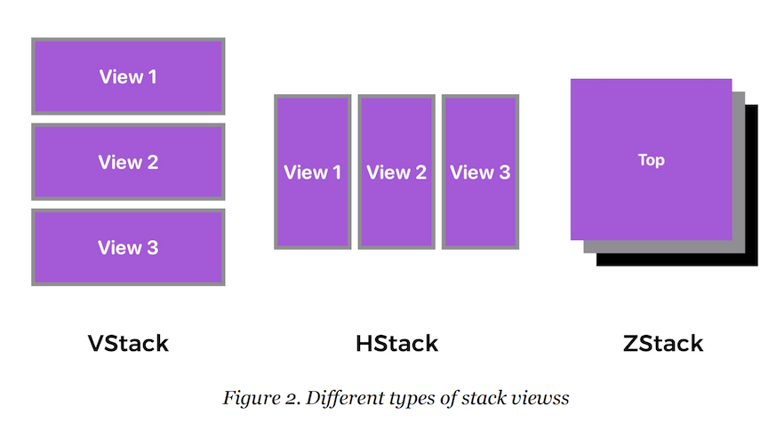

# Stack



记录下一些要点：

1.默认情况下，`VStack`中的view是居中对齐的

```swift
    /// Creates an instance with the given spacing and horizontal alignment.
    ///
    /// - Parameters:
    ///   - alignment: The guide for aligning the subviews in this stack. This
    ///     guide has the same vertical screen coordinate for every subview.
    ///   - spacing: The distance between adjacent subviews, or `nil` if you
    ///     want the stack to choose a default distance for each pair of
    ///     subviews.
    ///   - content: A view builder that creates the content of this stack.
    @inlinable public init(alignment: HorizontalAlignment = .center, spacing: CGFloat? = nil, @ViewBuilder content: () -> Content)
```

可通过`alignment`修改对齐方式

也可通过`spacing`指定间距


2.`.frame(minWidth: 0, maxWidth: .infinity, minHeight: 100)`

将maxWidth设置为`.infinity`，`HStack`中的子view宽度会一致


3.Spacer

参考：

+ [Spacer](https://developer.apple.com/documentation/swiftui/spacer)


4.将复杂的view拆分


例子如下：

```swift
struct ContentView: View {
    var body: some View {
        VStack {
            HeaderView()
            
            HStack (spacing: 15) {
                PricingView(title: "Basic", price: "$9", textColor: .white, bgColor: .purple)
                ZStack {
                    PricingView(title: "Pro", price: "$19", textColor: .black, bgColor: Color(red: 240/255, green: 240/255, blue: 240/255))
                    
                    Text("Best for designer")
                        .font(.system(.caption, design: .rounded))
                        .fontWeight(.bold)
                        .foregroundColor(.white)
                        .padding(5)
                        .background(Color(red: 255/255, green: 183/255, blue: 37/255))
                        .offset(x: 0, y: 87)
                }
            }
            .padding(.horizontal)
            
            ZStack {
                PricingView(title: "Team", price: "$299", textColor: .white, bgColor: Color(red: 62/255, green: 63/255, blue: 70/255), icon: "wand.and.rays")
                    .padding()
                
                Text("Perfect for teams with 20 members")
                    .font(.system(.caption, design: .rounded))
                    .fontWeight(.bold)
                    .foregroundColor(.white)
                    .padding(5)
                    .background(Color(red: 255/255, green: 183/255, blue: 37/255))
                    .offset(x: 0, y: 110)
                
            }
            
            // 作用是将整个view上移
            Spacer()
            
        }
    }
}

#Preview {
    ContentView()
}

struct HeaderView: View {
    var body: some View {
        HStack {
            // 默认是居中对齐，这里修改了对齐方式，还指定了间距
            VStack(alignment: .leading, spacing: 2) {
                Text("Choose")
                    .font(.system(.largeTitle, design: .rounded))
                    .fontWeight(.black)
                Text("Your Plan")
                    .font(.system(.largeTitle, design: .rounded))
                    .fontWeight(.black)
            }
            
            // 作用是将上面的view移动到左侧
            Spacer()
        }
        .padding()
    }
}

struct PricingView: View {
    var title: String
    var price: String
    var textColor: Color
    var bgColor: Color
    
    /// 是否有icon
    var icon: String?
    
    var body: some View {
        VStack {
            // 判断是否有icon
            if let icon = icon {
                Image(systemName: icon)
                    .font(.largeTitle)
                    .foregroundColor(textColor)
            }
            
            Text(title)
                .font(.system(.title, design: .rounded))
                .fontWeight(.black)
                .foregroundColor(textColor)
            Text(price)
                .font(.system(size: 40, weight: .heavy, design: .rounded))
                .foregroundColor(textColor)
            Text("per month")
                .font(.headline)
                .foregroundColor(textColor)
        }
        // 这里要保证VStack的宽度一致
        .frame(minWidth: 0, maxWidth: .infinity, minHeight: 100)
        .padding(40)
        .background(bgColor)
        .cornerRadius(10) // 圆角
    }
}

```


## 代码

[SwiftUIStacks](https://github.com/winfredzen/iOS-Basic/tree/master/SwiftUI/code/SwiftUIStacks)


