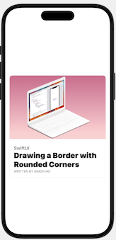
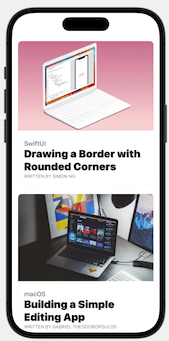

# ScrollView

记录一下要点


## CardView

实现一个CardView

1.圆角 - 使用`cornerRadius`修饰器

2.border

这里使用的是overlay的方式，`RoundedRectangle`

```swift
        .overlay( // border
            RoundedRectangle(cornerRadius: 10)
                .stroke(Color(.sRGB, red: 150/255, green: 150/255, blue: 150/255, opacity: 0.1), lineWidth: 1)
        )
```

代码如下：

```swift
import SwiftUI

struct CardView: View {
    var image: String
    var category: String
    var heading: String
    var author: String
    
    var body: some View {
        VStack {
            // 图片
            Image(image)
                .resizable()
                .aspectRatio(contentMode: .fit)
            
            HStack {
                VStack(alignment: .leading) {
                    Text(category)
                        .font(.headline)
                        .foregroundColor(.secondary)
                    Text(heading)
                        .font(.title)
                        .fontWeight(.black)
                        .foregroundColor(.primary)
                        .lineLimit(3)
                        .minimumScaleFactor(0.5)
                    Text("Written by \(author)".uppercased())
                        .font(.caption)
                        .foregroundColor(.secondary)
                }
                
                // 为了使上面的VStack左对齐
                Spacer()
            }
            .padding()
        }
        .cornerRadius(10)
        .overlay( // border
            RoundedRectangle(cornerRadius: 10)
                .stroke(Color(.sRGB, red: 150/255, green: 150/255, blue: 150/255, opacity: 0.1), lineWidth: 1)
        )
        .padding([.top, .horizontal])
        
    }
}

#Preview {
    CardView(image: "swiftui-button", category: "SwiftUI", heading: "Drawing a Border with Rounded Corners", author: "Simon Ng")
}
```




## 竖直滑动ScrollView

`ScrollView`的初始化方法

```swift
public init(_ axes: Axis.Set = .vertical, showsIndicators: Bool = true, @ViewBuilder content: () -> Content)
```

其默认为竖直滑动，例如将一个`VStack`放入`ScrollView`中即可实现竖直滑动：

```swift
        ScrollView {
            VStack {
                CardView(image: "swiftui-button", category: "SwiftUI", heading: "Drawing a Border with Rounded Corners", author: "Simon Ng")
                CardView(image: "macos-programming", category: "macOS", heading: "Building a Simple Editing App", author: "Gabriel Theodoropoulos")
                CardView(image: "flutter-app", category: "Flutter", heading: "Building a Complex Layout with Flutter", author: "Lawrence Tan")
                CardView(image: "natural-language-api", category: "iOS", heading: "What's New in Natural Language API", author: "Sai Kambampati")
            }
        }
```




## 水平滑动ScrollView

指定`ScrollView`的滚动方向即可

```swift
ScrollView(.horizontal, showsIndicators: false)
```

如下的例子：

```swift
        
        VStack {
            HStack {
                VStack(alignment: .leading) {
                    Text("MONDAY, AUG 20")
                        .font(.caption)
                        .foregroundColor(.secondary)
                    Text("Your Reading")
                        .font(.system(.largeTitle, design: .rounded))
                        .fontWeight(.black)
                }
                
                Spacer()
            }
            .padding([.top, .horizontal])
            
            
            ScrollView(.horizontal, showsIndicators: false) {
                HStack {
                    Group {
                        CardView(image: "swiftui-button", category: "SwiftUI", heading: "Drawing a Border with Rounded Corners", author: "Simon Ng")
                        CardView(image: "macos-programming", category: "macOS", heading: "Building a Simple Editing App", author: "Gabriel Theodoropoulos")
                        CardView(image: "flutter-app", category: "Flutter", heading: "Building a Complex Layout with Flutter", author: "Lawrence Tan")
                        CardView(image: "natural-language-api", category: "iOS", heading: "What's New in Natural Language API", author: "Sai Kambampati")
                    } // 通过Group，统一设置width
                    .frame(width: 300)
                }
            }
            
            Spacer()
        }
```


## 代码

[SwiftUIScrollView](https://github.com/winfredzen/iOS-Basic/tree/master/SwiftUI/code/SwiftUIScrollView)


