# Button

最简单的创建一个Button的方式是使用默认Text样式，如下：

```swift
            Button("Regular Button") {
                
            }
```

另一种方式是自定义button的content：

```swift
            Button {
                
            } label: {
                Text("Regular Button").bold()
            }
```

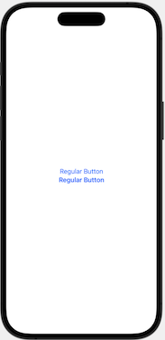


如下的写法：

```swift
            Button {
                print("Hello World tapped!")
            } label: {
                Text("Hello Word")
            }
```

等价于：

```swift
            Button(action: {
                print("Hello World tapped!")
            }, label: {
                Text("Hello Word")
            })
```

这种形式是[Multiple trailing closures](https://www.hackingwithswift.com/swift/5.3/multiple-trailing-closures)


## 修饰器的顺序

如果给Button添加padding，将`.padding()`放在最后时的效果：

```swift
            Button {
                print("Hello World tapped!")
            } label: {
                Text("Hello Word")
                    .background(Color.purple)
                    .foregroundColor(.white)
                    .font(.title)
                    .padding()
            }
```

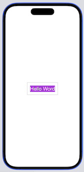

如果将`.padding()`放在`.background`前面，则是另一种显示效果：

```swift
            Button {
                print("Hello World tapped!")
            } label: {
                Text("Hello Word")
                    .padding()
                    .background(Color.purple)
                    .foregroundColor(.white)
                    .font(.title)
            }
```

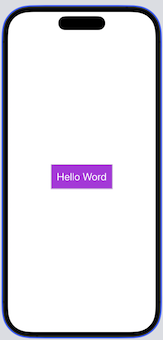


## Border

如：

```swift
            Button {
                print("Hello World tapped!")
            } label: {
                Text("Hello Word")
                    .background(Color.purple)
                    .foregroundColor(.white)
                    .font(.title)
                    .padding()
                    .border(Color.purple, width: 5)
            }
```

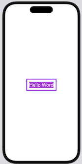


而如下的形式，再添加一个padding，可实现如下的效果：

```swift
            Button {
                print("Hello World tapped!")
            } label: {
                Text("Hello Word")
                    .padding()
                    .background(Color.purple)
                    .foregroundColor(.white)
                    .font(.title)
                    .padding(10)
                    .border(Color.purple, width: 5)
            }
```

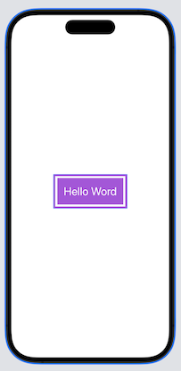

**圆角**

如果直接使用`.cornerRadius`修饰器，它只是给背景添加了圆角，如下：

```swift
            Button {
                print("Hello World tapped!")
            } label: {
                Text("Hello Word")
                    .padding()
                    .background(Color.purple)
                    .cornerRadius(40)
                    .foregroundColor(.white)
                    .font(.title)
                    .padding(10)
                    .border(Color.purple, width: 5)
            }
```

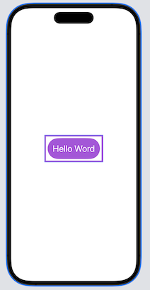


使用`overlay`来解决：

```swift
            Button {
                print("Hello World tapped!")
            } label: {
                Text("Hello Word")
                    .padding()
                    .background(Color.purple)
                    .cornerRadius(40)
                    .foregroundColor(.white)
                    .font(.title)
                    .padding(10)
                    .overlay {
                        RoundedRectangle(cornerRadius: 40)
                            .stroke(.purple, lineWidth: 5)
                    }

            }
```

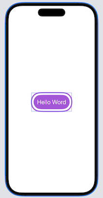


## 带有Image和Text的Button

```swift
            Button(action: {
                print("Delete button tapped!")
            }) {
                HStack {
                    Image(systemName: "trash")
                        .font(.title)
                    Text("Delete")
                        .fontWeight(.semibold)
                        .font(.title)
                }
                .padding()
                .foregroundColor(.white)
                .background(.red)
                .cornerRadius(40)

            }
```

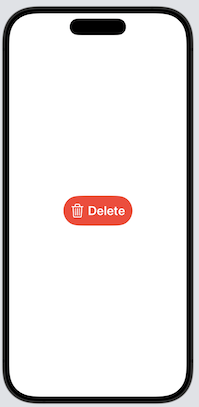


## Label

从 iOS 14 开始，SwiftUI 框架引入了一个名为 Label 的新视图，可让并排放置图像和文本。 因此，可以使用 Label 来创建相同的布局，而不是使用 HStack 

```swift
            Button {
                print("Delete button tapped")
            } label: {
                Label(
                    title: {
                        Text("Delete")
                            .fontWeight(.semibold)
                            .font(.title)
                    },
                    icon: {
                        Image(systemName: "trash")
                            .font(.title)
                    }
                )
                .padding()
                .foregroundColor(.white)
                .background(.red)
                .cornerRadius(40)
            }
```

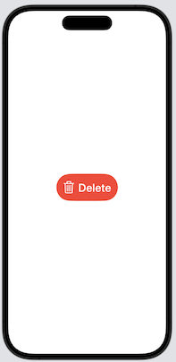


## 渐变色与阴影

在`background`中使用`LinearGradient`

```swift
            Button {
                print("Delete button tapped")
            } label: {
                Label(
                    title: {
                        Text("Delete")
                            .fontWeight(.semibold)
                            .font(.title)
                    },
                    icon: {
                        Image(systemName: "trash")
                            .font(.title)
                    }
                )
                .padding()
                .foregroundColor(.white)
                .background(LinearGradient(gradient: Gradient(colors: [Color.red, Color.blue]), startPoint: .leading, endPoint: .trailing))
                .cornerRadius(40)
            }
```

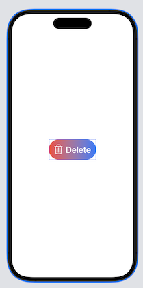

渐变颜色也可以使用`Assets`的*Color Set*

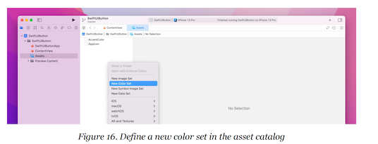


**阴影**

```swift
.shadow(color: .gray, radius: 20.0, x: 20, y: 10)
```

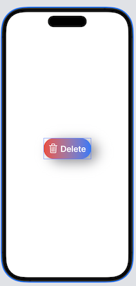


## Full-width Button

使用`frame`修饰器`.frame(minWidth: 0, maxWidth: .infinity)`，来创建Full-width Button

```swift
            Button(action: {
                print("Delete tapped!")
            }) {
                HStack {
                    Image(systemName: "trash")
                        .font(.title)
                    Text("Delete")
                        .fontWeight(.semibold)
                        .font(.title)
                }
                .frame(minWidth: 0, maxWidth: .infinity)
                .padding()
                .foregroundColor(.white)
                .background(LinearGradient(gradient: Gradient(colors: [Color("DarkGreen"), Color("LightGreen")]), 
                                           startPoint: .leading,
                                           endPoint: .trailing))
                .cornerRadius(40)
            }
```

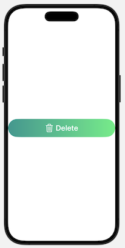


## ButtonStyle

多个Button拥有同样的风格，如果按上面的创建Button的形式，会造成代码重复

SwiftUI 提供了一个名为 `ButtonStyle` 的协议，供创建自己的按钮样式

如下的例子，自定义`GradientBackgroundStyle`

```swift
struct GradientBackgroundStyle: ButtonStyle {
    func makeBody(configuration: Configuration) -> some View {
        configuration.label
            .frame(minWidth: 0, maxWidth: .infinity)
            .padding()
            .foregroundColor(.white)
            .background(LinearGradient(gradient: Gradient(colors: [Color("DarkGreen"), Color("LightGreen")]), startPoint: .leading, endPoint: .trailing))
            .cornerRadius(40)
            .padding(.horizontal, 20)
            .scaleEffect(configuration.isPressed ? 0.9 : 1.0)
    }
}
```

`scaleEffect`修饰器可以放大or缩小按钮

```swift
.scaleEffect(configuration.isPressed ? 0.9 : 1.0)
```

按钮：

```swift
            Button {
                print("Share button tapped")
            } label: {
                Label(
                    title: {
                        Text("Share")
                            .fontWeight(.semibold)
                            .font(.title)
                    },
                    icon: {
                        Image(systemName: "square.and.arrow.up")
                            .font(.title)
                    }
                )
            }
            .buttonStyle(GradientBackgroundStyle())
            
            Button {
                print("Edit button tapped")
            } label: {
                Label(
                    title: {
                        Text("Edit")
                            .fontWeight(.semibold)
                            .font(.title)
                    },
                    icon: {
                        Image(systemName: "square.and.pencil")
                            .font(.title)
                    }
                )
            }
            .buttonStyle(GradientBackgroundStyle())
            
            Button {
                print("Delete button tapped")
            } label: {
                Label(
                    title: {
                        Text("Delete")
                            .fontWeight(.semibold)
                            .font(.title)
                    },
                    icon: {
                        Image(systemName: "trash")
                            .font(.title)
                    }
                )
            }
            .buttonStyle(GradientBackgroundStyle())
```

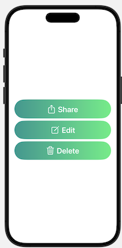


## Styling a Button in iOS 15

在iOS 15中，苹果为Button引入了一些新的修饰器

```swift
            Button {
            } label: {
                Text("Buy me a coffee")
            }
            .tint(.purple)
            .buttonStyle(.borderedProminent)
            .buttonBorderShape(.roundedRectangle(radius: 5))
            .controlSize(.large)
```

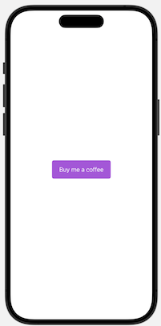


`.tint`指定Button的颜色

 `.borderedProminent`iOS以紫色背景呈现按钮，并以白色显示文本

`.buttonBorderShape`设置border

`.controlSize`改变button的大小，默认为`.regular` ，其它值包括， `.large`、`.small`、`.mini`


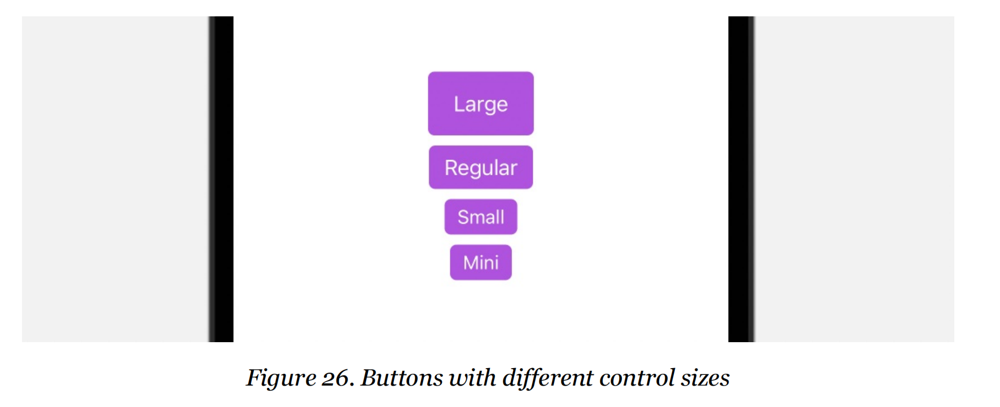


除了使用 `.roundedRectangle`，SwiftUI也提供了其它Border Shape，如`.capsule`

```swift
            Button {
            } label: {
                Text("Buy me a coffee")
            }
            .tint(.purple)
            .buttonStyle(.borderedProminent)
            .buttonBorderShape(.capsule)
            .controlSize(.large)
```

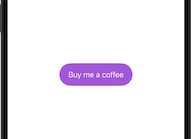


也可以使用`.automatic` ，让系统自动调整shape


除了使用 `.borderProminent`按钮风格，还可以使用 `.bordered` , `.borderless` , 和 `.plain` 

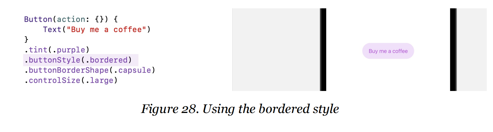


## 为多个Button应用Style

```swift
            VStack {
                Button(action: {}) {
                    Text("Add to Cart")
                        .font(.headline)
                }
                Button(action: {}) {
                    Text("Discover")
                        .font(.headline)
                        .frame(maxWidth: 300)
                }
                Button(action: {}) {
                    Text("Check out")
                        .font(.headline)
                }
            }
            .tint(.purple)
            .buttonStyle(.bordered)
            .controlSize(.large)
```

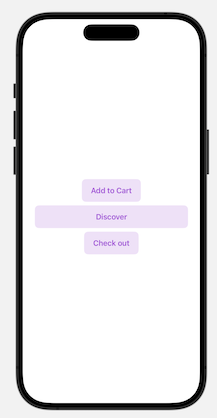


## 使用Button Role

iOS15中，SwiftUI引入了一个`role`选项

该选项描述了按钮的语义角色。 根据给定的角色，iOS 会自动为按钮呈现适当的外观和感觉。

如：

```swift
            Button("Delete", role: .destructive) {
                print("Delete")
            }
            .buttonStyle(.borderedProminent)
            .controlSize(.large)
```

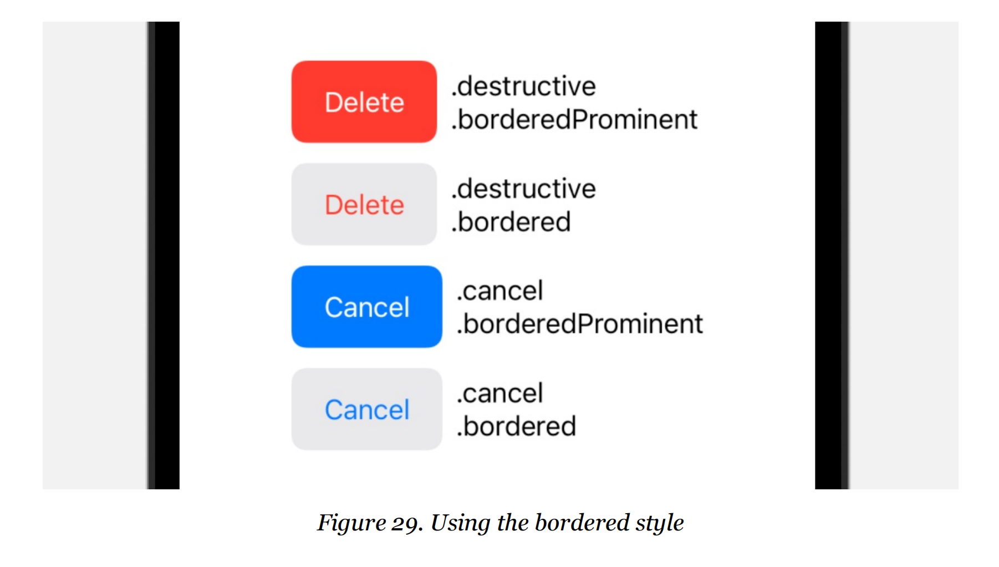


## 代码

[SwiftUIButton](https://github.com/winfredzen/iOS-Basic/tree/master/SwiftUI/code/SwiftUIButton)


