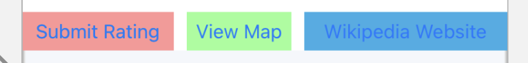
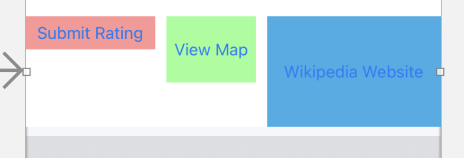
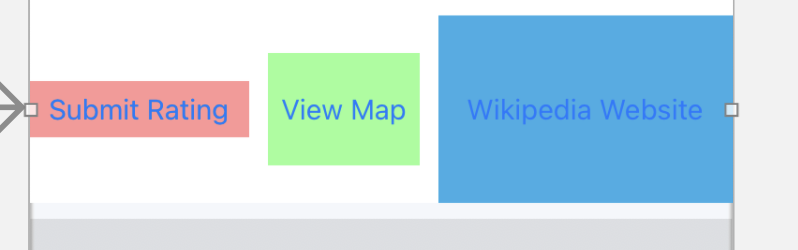
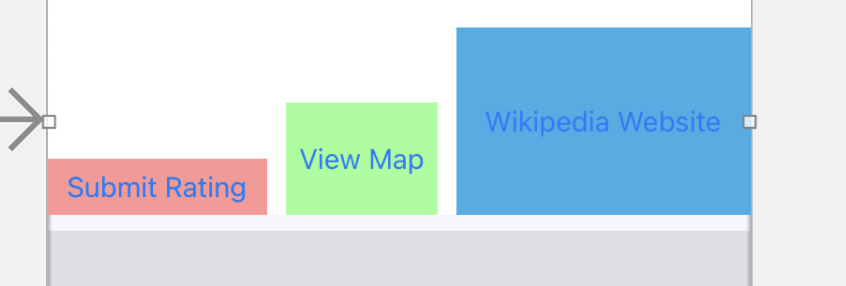
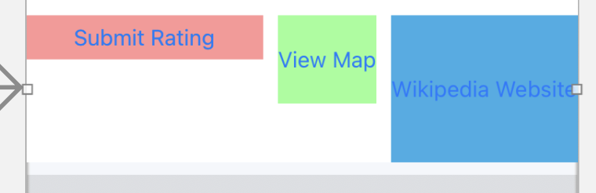
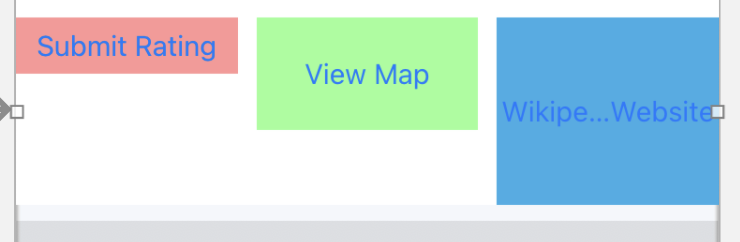
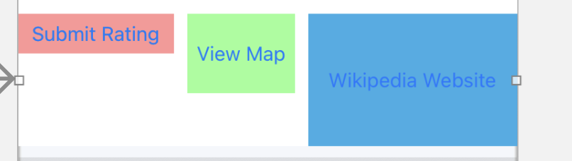
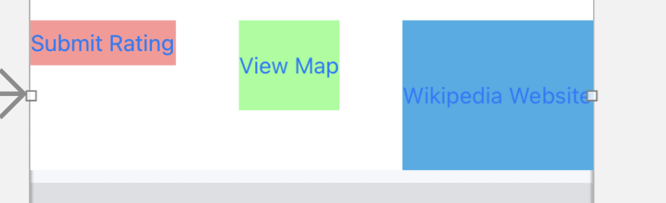
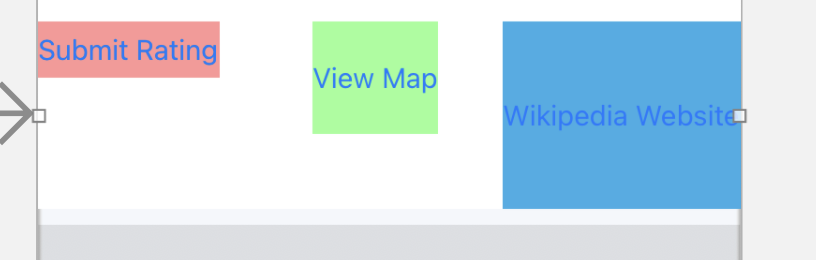
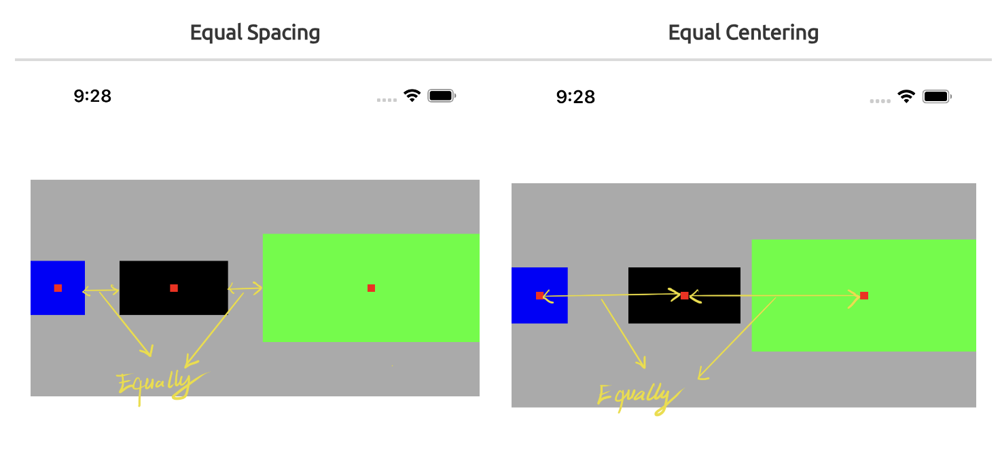

# UIStackView

`axis` - 控制布局的方向

`alignment` - 控制对齐的方式

`distribution` - 控制view怎么分布

`spacing` - 控制间距

以[UIStackView Tutorial for iOS: Introducing Stack Views](https://www.kodeco.com/2198310-uistackview-tutorial-for-ios-introducing-stack-views)中的例子来说明

先约束red，green，blue三个view的高度为30， 60， 100，`distribution`为`fillProportionally`

修改`alignment`

1.`Fill`

测试view的高度约束失效，统一变为30

2.`top`

3.`Center`

4.`Bottom`

`alignment`为`top`，修改`distribution`，此时`spacing`为10

1.`Fill`

对比起来，感觉第一个red视图，宽度有拉伸

2.`Fill Equally`

此时应该是宽度相等

3.`fillProportionally`

4.`Equal Spacing`

保证间距一致，view宽度都有变化

5.`Equal Centering`

中间green视图位置有变化

这其中的具体的含义，可参考：

+ [iOS: Introducing Stack Views Programmatically](https://uynguyen.github.io/2020/07/18/iOS-Introducing-Stack-Views/)

1.**Equal Spacing** vs  **Equal Centering**

2.当view的大小有调整时，应该调整哪个View呢？

>So the question is, what criteria will it base on to choose the view to resize? **Content Hugging Priority (CHP)** will be. To determine which view will be stretched, the stack view will rely on CHP for evaluation, the lower its priority, the more likely it is to be chosen. If all the views have the same CHP, the first one will be picked.

