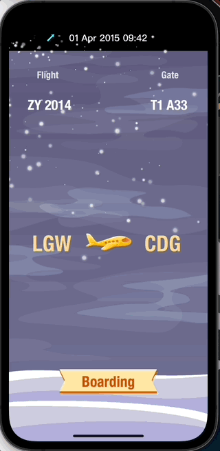

# 仿射变换实现立方体动画

记录下学习《iOS Animations by Tutorials》中的经典例子

如下的例子，通过仿射变换实现立方体动画

```swift
/// Copyright (c) 2022-present Razeware LLC
///
/// Permission is hereby granted, free of charge, to any person obtaining a copy
/// of this software and associated documentation files (the "Software"), to deal
/// in the Software without restriction, including without limitation the rights
/// to use, copy, modify, merge, publish, distribute, sublicense, and/or sell
/// copies of the Software, and to permit persons to whom the Software is
/// furnished to do so, subject to the following conditions:
///
/// The above copyright notice and this permission notice shall be included in
/// all copies or substantial portions of the Software.
///
/// Notwithstanding the foregoing, you may not use, copy, modify, merge, publish,
/// distribute, sublicense, create a derivative work, and/or sell copies of the
/// Software in any work that is designed, intended, or marketed for pedagogical or
/// instructional purposes related to programming, coding, application development,
/// or information technology.  Permission for such use, copying, modification,
/// merger, publication, distribution, sublicensing, creation of derivative works,
/// or sale is expressly withheld.
///
/// This project and source code may use libraries or frameworks that are
/// released under various Open-Source licenses. Use of those libraries and
/// frameworks are governed by their own individual licenses.
///
/// THE SOFTWARE IS PROVIDED "AS IS", WITHOUT WARRANTY OF ANY KIND, EXPRESS OR
/// IMPLIED, INCLUDING BUT NOT LIMITED TO THE WARRANTIES OF MERCHANTABILITY,
/// FITNESS FOR A PARTICULAR PURPOSE AND NONINFRINGEMENT. IN NO EVENT SHALL THE
/// AUTHORS OR COPYRIGHT HOLDERS BE LIABLE FOR ANY CLAIM, DAMAGES OR OTHER
/// LIABILITY, WHETHER IN AN ACTION OF CONTRACT, TORT OR OTHERWISE, ARISING FROM,
/// OUT OF OR IN CONNECTION WITH THE SOFTWARE OR THE USE OR OTHER DEALINGS IN
/// THE SOFTWARE.

import UIKit
import QuartzCore

// A delay function
func delay(seconds: Double, completion: @escaping () -> Void) {
  DispatchQueue.main.asyncAfter(deadline: .now() + seconds, execute: completion)
}

class ViewController: UIViewController {
  enum AnimationDirection: Int {
    case positive = 1
    case negative = -1
  }

  @IBOutlet var bgImageView: UIImageView!

  @IBOutlet var summaryIcon: UIImageView!
  @IBOutlet var summary: UILabel!

  @IBOutlet var flightNr: UILabel!
  @IBOutlet var gateNr: UILabel!
  @IBOutlet var departingFrom: UILabel!
  @IBOutlet var arrivingTo: UILabel!
  @IBOutlet var planeImage: UIImageView!

  @IBOutlet var flightStatus: UILabel!
  @IBOutlet var statusBanner: UIImageView!

  let snowView = SnowView(frame: CGRect(x: -150, y: -100, width: 300, height: 50))

  // MARK: view controller methods

  override func viewDidLoad() {
    super.viewDidLoad()

    //adjust ui
    summary.addSubview(summaryIcon)
    summaryIcon.center.y = summary.frame.size.height / 2

    //add the snow effect layer
    let snowClipView = UIView(frame: view.frame.offsetBy(dx: 0, dy: 50))
    snowClipView.clipsToBounds = true
    snowClipView.addSubview(snowView)
    view.addSubview(snowClipView)

    //start rotating the flights
    changeFlight(to: londonToParis)
  }

  // MARK: custom methods

  func changeFlight(to data: FlightData, animated: Bool = false) {
    // populate the UI with the next flight's data
    summary.text = data.summary

    if animated {
      fade(
        imageView: bgImageView,
        toImage: UIImage(named: data.weatherImageName)!,
        showEffects: data.showWeatherEffects
      )

      let direction: AnimationDirection = data.isTakingOff ? .positive : .negative

      cubeTransition(label: flightNr, text: data.flightNr, direction: direction)
      cubeTransition(label: gateNr, text: data.gateNr, direction: direction)

      let offsetDeparting = CGPoint(x: CGFloat(direction.rawValue * 80), y: 0.0)
      moveLabel(label: departingFrom, text: data.departingFrom, offset: offsetDeparting)

      let offsetArriving = CGPoint(x: 0.0, y: CGFloat(direction.rawValue * 50))
      moveLabel(label: arrivingTo, text: data.arrivingTo, offset: offsetArriving)

      cubeTransition(
        label: flightStatus,
        text: data.flightStatus,
        direction: direction
      )
    } else {
      bgImageView.image = UIImage(named: data.weatherImageName)
      snowView.isHidden = !data.showWeatherEffects

      flightNr.text = data.flightNr
      gateNr.text = data.gateNr
      departingFrom.text = data.departingFrom
      arrivingTo.text = data.arrivingTo
      flightStatus.text = data.flightStatus
    }

    // schedule next flight
    delay(seconds: 3.0) {
      self.changeFlight(to: data.isTakingOff ? parisToRome : londonToParis, animated: true)
    }
  }

  /// Image变化的动画
  func fade(imageView: UIImageView, toImage: UIImage, showEffects: Bool) {
    UIView.transition(with: imageView, duration: 1.0, options: .transitionCrossDissolve, animations: {
      imageView.image = toImage
    }, completion: nil)

    UIView.animate(withDuration: 1.0, delay: 0.0, options: .curveEaseOut, animations: {
      self.snowView.alpha = showEffects ? 1.0 : 0.0
    }, completion: nil)
  }

  /// 立方体动画
  func cubeTransition(label: UILabel, text: String, direction: AnimationDirection) {
    let auxLabel = UILabel(frame: label.frame)
    auxLabel.text = text
    auxLabel.font = label.font
    auxLabel.textAlignment = label.textAlignment
    auxLabel.textColor = label.textColor
    auxLabel.backgroundColor = label.backgroundColor

    let auxLabelOffset = CGFloat(direction.rawValue) * label.frame.size.height / 2.0
    auxLabel.transform = CGAffineTransform(translationX: 0.0, y: auxLabelOffset)
      .scaledBy(x: 1.0, y: 0.1)

    label.superview?.addSubview(auxLabel)

    UIView.animate(withDuration: 0.5, delay: 0.0, options: .curveEaseOut, animations: {
      auxLabel.transform = .identity
      label.transform = CGAffineTransform(translationX: 0.0, y: -auxLabelOffset)
        .scaledBy(x: 1.0, y: 0.1)
    }, completion: { _ in
      label.text = auxLabel.text
      label.transform = .identity

      auxLabel.removeFromSuperview()
    })
  }

  func moveLabel(label: UILabel, text: String, offset: CGPoint) {
    let auxLabel = UILabel(frame: label.frame)
    auxLabel.text = text
    auxLabel.font = label.font
    auxLabel.textAlignment = label.textAlignment
    auxLabel.textColor = label.textColor
    auxLabel.backgroundColor = .clear

    auxLabel.transform = CGAffineTransform(translationX: offset.x, y: offset.y)
    auxLabel.alpha = 0
    view.addSubview(auxLabel)

    UIView.animate(withDuration: 0.5, delay: 0.0, options: .curveEaseIn, animations: {
      label.transform = CGAffineTransform(translationX: offset.x, y: offset.y)
      label.alpha = 0.0
    }, completion: nil)

    UIView.animate(withDuration: 0.25, delay: 0.1, options: .curveEaseIn, animations: {
      auxLabel.transform = .identity
      auxLabel.alpha = 1.0
    }, completion: {_ in
      // clean up
      auxLabel.removeFromSuperview()
      label.text = text
      label.alpha = 1.0
      label.transform = .identity
    })
  }
}

```



代码地址：[code](https://github.com/winfredzen/iOS-Basic/tree/master/%E5%8A%A8%E7%94%BB/code/CubeAnimation)


