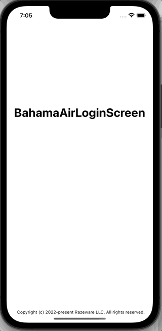

# View Animation

记录下学习《iOS Animations by Tutorials》中的经典例子

该例子包含了：

+ view动画
+ Spring动画
+ transition动画

如下的代码：

```swift
/// Copyright (c) 2022-present Razeware LLC
///
/// Permission is hereby granted, free of charge, to any person obtaining a copy
/// of this software and associated documentation files (the "Software"), to deal
/// in the Software without restriction, including without limitation the rights
/// to use, copy, modify, merge, publish, distribute, sublicense, and/or sell
/// copies of the Software, and to permit persons to whom the Software is
/// furnished to do so, subject to the following conditions:
///
/// The above copyright notice and this permission notice shall be included in
/// all copies or substantial portions of the Software.
///
/// Notwithstanding the foregoing, you may not use, copy, modify, merge, publish,
/// distribute, sublicense, create a derivative work, and/or sell copies of the
/// Software in any work that is designed, intended, or marketed for pedagogical or
/// instructional purposes related to programming, coding, application development,
/// or information technology.  Permission for such use, copying, modification,
/// merger, publication, distribution, sublicensing, creation of derivative works,
/// or sale is expressly withheld.
///
/// This project and source code may use libraries or frameworks that are
/// released under various Open-Source licenses. Use of those libraries and
/// frameworks are governed by their own individual licenses.
///
/// THE SOFTWARE IS PROVIDED "AS IS", WITHOUT WARRANTY OF ANY KIND, EXPRESS OR
/// IMPLIED, INCLUDING BUT NOT LIMITED TO THE WARRANTIES OF MERCHANTABILITY,
/// FITNESS FOR A PARTICULAR PURPOSE AND NONINFRINGEMENT. IN NO EVENT SHALL THE
/// AUTHORS OR COPYRIGHT HOLDERS BE LIABLE FOR ANY CLAIM, DAMAGES OR OTHER
/// LIABILITY, WHETHER IN AN ACTION OF CONTRACT, TORT OR OTHERWISE, ARISING FROM,
/// OUT OF OR IN CONNECTION WITH THE SOFTWARE OR THE USE OR OTHER DEALINGS IN
/// THE SOFTWARE.

import UIKit

// A delay function
func delay(_ seconds: Double, completion: @escaping () -> Void) {
  DispatchQueue.main.asyncAfter(deadline: .now() + seconds, execute: completion)
}

class ViewController: UIViewController {
  // MARK: IB outlets

  @IBOutlet var loginButton: UIButton!
  @IBOutlet var heading: UILabel!
  @IBOutlet var username: UITextField!
  @IBOutlet var password: UITextField!

  @IBOutlet var cloud1: UIImageView!
  @IBOutlet var cloud2: UIImageView!
  @IBOutlet var cloud3: UIImageView!
  @IBOutlet var cloud4: UIImageView!

  // MARK: further UI

  let spinner = UIActivityIndicatorView(style: .large)
  let status = UIImageView(image: UIImage(named: "banner"))
  let label = UILabel()
  let messages = ["Connecting ...", "Authorizing ...", "Sending credentials ...", "Failed"]

  var statusPosition = CGPoint.zero

  // MARK: view controller methods

  override func viewDidLoad() {
    super.viewDidLoad()

    //set up the UI
    loginButton.layer.cornerRadius = 8.0
    loginButton.layer.masksToBounds = true

    spinner.frame = CGRect(x: -20.0, y: 6.0, width: 20.0, height: 20.0)
    spinner.startAnimating()
    spinner.alpha = 0.0
    loginButton.addSubview(spinner)

    status.isHidden = true
    status.center = loginButton.center
    view.addSubview(status)

    label.frame = CGRect(x: 0.0, y: 0.0, width: status.frame.size.width, height: status.frame.size.height)
    label.font = UIFont(name: "HelveticaNeue", size: 18.0)
    label.textColor = UIColor(red: 0.89, green: 0.38, blue: 0.0, alpha: 1.0)
    label.textAlignment = .center
    status.addSubview(label)

    statusPosition = status.center
  }

  override func viewWillAppear(_ animated: Bool) {
    super.viewWillAppear(animated)

    heading.center.x -= view.bounds.width
    username.center.x -= view.bounds.width
    password.center.x -= view.bounds.width

    cloud1.alpha = 0.0
    cloud2.alpha = 0.0
    cloud3.alpha = 0.0
    cloud4.alpha = 0.0

    loginButton.center.y += 30.0
    loginButton.alpha = 0.0
  }

  override func viewDidAppear(_ animated: Bool) {
    super.viewDidAppear(animated)

    UIView.animate(withDuration: 0.5) {
      self.heading.center.x += self.view.bounds.width
    }
    // 延时动画
    UIView.animate(
      withDuration: 0.5,
      delay: 0.3,
      usingSpringWithDamping: 0.6,
      initialSpringVelocity: 0.0,
      options: [],
      animations: {
        self.username.center.x += self.view.bounds.width
      },
      completion: nil
    )
    UIView.animate(
      withDuration: 0.5,
      delay: 0.4,
      usingSpringWithDamping: 0.6,
      initialSpringVelocity: 0.0,
      options: [],
      animations: {
        self.password.center.x += self.view.bounds.width
      },
      completion: nil
    )

    // cloud view动画
    UIView.animate(withDuration: 0.5, delay: 0.5, options: [], animations: {
      self.cloud1.alpha = 1.0
    }, completion: nil)

    UIView.animate(withDuration: 0.5, delay: 0.7, options: [], animations: {
      self.cloud2.alpha = 1.0
    }, completion: nil)

    UIView.animate(withDuration: 0.5, delay: 0.9, options: [], animations: {
      self.cloud3.alpha = 1.0
    }, completion: nil)

    UIView.animate(withDuration: 0.5, delay: 1.1, options: [], animations: {
      self.cloud4.alpha = 1.0
    }, completion: nil)

    UIView.animate(
      withDuration: 0.5,
      delay: 0.5,
      usingSpringWithDamping: 0.5,
      initialSpringVelocity: 0.0,
      options: [],
      animations: {
        self.loginButton.center.y -= 30.0
        self.loginButton.alpha = 1.0
      },
      completion: nil
    )
    
    // cloud的位移动画
    animateCloud(cloud1)
    animateCloud(cloud2)
    animateCloud(cloud3)
    animateCloud(cloud4)
  }

  /// 展示登录信息
  func showMessage(index: Int) {
    label.text = messages[index]

    // transition动画，显示status，动画效果为transitionFlipFromTop
    UIView.transition(with: status, duration: 0.33, options: [.curveEaseOut, .transitionFlipFromTop], animations: {
      self.status.isHidden = false
    }, completion: { _ in
      // transition completion
      delay(2.0) {
        if index < self.messages.count - 1 {
          self.removeMessage(index: index)
        } else {
          //reset form
          self.resetForm()
        }
      }
    })
  }

  func removeMessage(index: Int) {
    UIView.animate(withDuration: 0.33, delay: 0.0, options: [], animations: {
      self.status.center.x += self.view.frame.size.width
    }, completion: { _ in
      // 隐藏status
      self.status.isHidden = true
      self.status.center = self.statusPosition

      self.showMessage(index: index + 1)
    })
  }

  func resetForm() {
    UIView.transition(with: status, duration: 0.2, options: .transitionFlipFromTop, animations: {
      self.status.isHidden = true
      self.status.center = self.statusPosition
    }, completion: nil)

    UIView.animate(withDuration: 0.2, delay: 0.0, options: [], animations: {
      self.spinner.center = CGPoint(x: -20.0, y: 16.0)
      self.spinner.alpha = 0.0
      self.loginButton.backgroundColor = UIColor(red: 0.63, green: 0.84, blue: 0.35, alpha: 1.0)
      self.loginButton.bounds.size.width -= 80.0
      self.loginButton.center.y -= 60.0
    }, completion: nil)
  }
  
  /// cloud的位移动动画，从屏幕左侧移动至右侧，递归调用
  func animateCloud(_ cloud: UIImageView) {
    let cloudSpeed = 60.0 / view.frame.size.width
    let duration = (view.frame.size.width - cloud.frame.origin.x) * cloudSpeed
    UIView.animate(withDuration: TimeInterval(duration), delay: 0.0, options: .curveLinear, animations: {
      cloud.frame.origin.x = self.view.frame.size.width
    }, completion: { _ in
      cloud.frame.origin.x = -cloud.frame.size.width
      self.animateCloud(cloud)
    })
  }

  // MARK: further methods

  /// 登录按钮事件
  @IBAction func login() {
    view.endEditing(true)

    // 弹簧动画
    UIView.animate(
      withDuration: 1.5,
      delay: 0.0,
      usingSpringWithDamping: 0.2,
      initialSpringVelocity: 0.0,
      options: [],
      animations: {
        self.loginButton.bounds.size.width += 80.0
      },
      completion: { _ in
        self.showMessage(index: 0)
      }
    )

    UIView.animate(
      withDuration: 0.33,
      delay: 0.0,
      usingSpringWithDamping: 0.7,
      initialSpringVelocity: 0.0,
      options: [],
      animations: {
        self.loginButton.center.y += 60.0
        self.loginButton.backgroundColor = UIColor(red: 0.85, green: 0.83, blue: 0.45, alpha: 1.0)
        self.spinner.center = CGPoint(
          x: 40.0,
          y: self.loginButton.frame.size.height / 2
        )
        self.spinner.alpha = 1.0
      },
      completion: nil
    )
  }

  // MARK: UITextFieldDelegate

  func textFieldShouldReturn(_ textField: UITextField) -> Bool {
    let nextField = (textField === username) ? password : username
    nextField?.becomeFirstResponder()
    return true
  }
}

```



代码地址：[code](https://github.com/winfredzen/iOS-Basic/tree/master/%E5%8A%A8%E7%94%BB/code/ViewAnimation)
