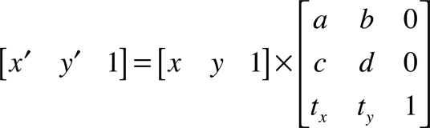
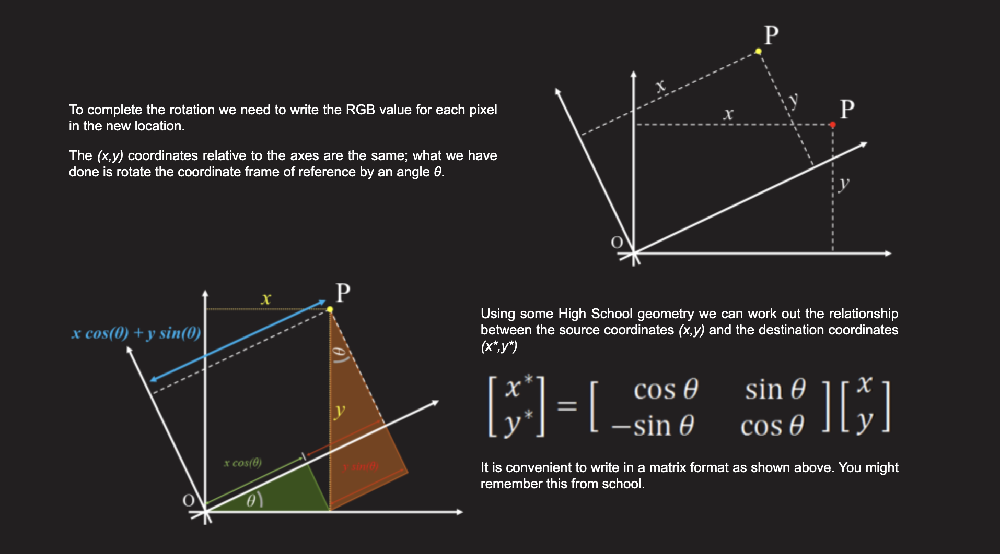

# 图片仿射变换原理

图片仿射变换原理涉及到矩阵相关的知识

在iOS中2D变化通常会使用[CGAffineTransform](https://developer.apple.com/documentation/corefoundation/cgaffinetransform)，其大致定义是这样的：

```swift
/*                      |------------------ CGAffineTransformComponents ----------------|
 *
 *      | a  b  0 |     | sx  0  0 |   |  1  0  0 |   | cos(t)  sin(t)  0 |   | 1  0  0 |
 *      | c  d  0 |  =  |  0 sy  0 | * | sh  1  0 | * |-sin(t)  cos(t)  0 | * | 0  1  0 |
 *      | tx ty 1 |     |  0  0  1 |   |  0  0  1 |   |   0       0     1 |   | tx ty 1 |
 *  CGAffineTransform      scale           shear            rotation          translation
 */
```

> Affine transforms are represented by a 3 by 3 matrix:
>
> 
>
> 从概念上讲，仿射变换将表示绘图中每个点 `(x,y)` 的行向量乘以该矩阵，生成表示对应点 `(x',y')` 的向量：
>
> 
>
> 给定 `3 x 3` 矩阵，以下方程用于将一个坐标系中的点 `(x, y)` 转换为另一个坐标系中的结果点 `(x',y')`
>
> 


## 如何理解旋转？

如上文所展示，旋转为何是？

```swift
| cos(t)  sin(t)  0 |
|-sin(t)  cos(t)  0 |
|   0       0     1 |
      rotation       
```

参考：

+ [Rotating Images](http://datagenetics.com/blog/august32013/index.html)





