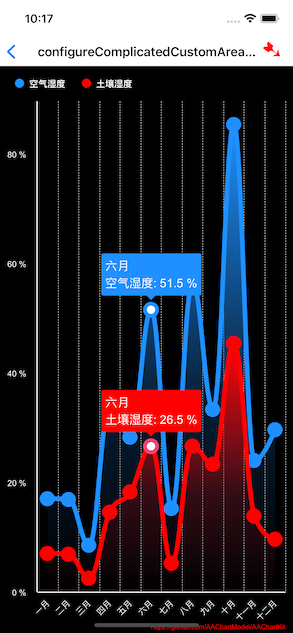
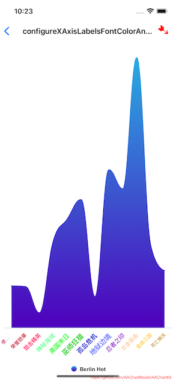
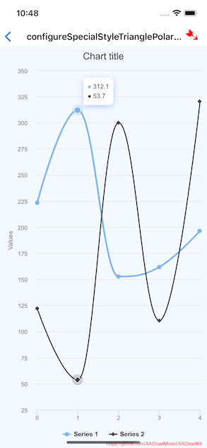

# AAChartKit使用

[AAChartKit](https://github.com/AAChartModel/AAChartKit)是一个开源的图标库，项目中用到了这库，所以记录下使用过程以及遇到的问题

## 基本
基本使用方式参考官方文档说明
1.创建`AAChartView`
2.创建模型`AAChartModel`
3.绘制

```objectivec
/*图表视图对象调用图表模型对象,绘制最终图形*/
[_aaChartView aa_drawChartWithChartModel:aaChartModel];
```

**刷新**

1.仅仅刷新图形的数据

```objectivec
/*仅仅更新 AAChartModel 对象的 series 属性时,动态刷新图表*/
[_aaChartView aa_onlyRefreshTheChartDataWithChartModelSeries:aaChartModelSeriesArray];
```

2.刷新图形除数据属性 `series` 以外的其他属性

```objectivec
/*更新 AAChartModel 内容之后,刷新图表*/
[_aaChartView aa_refreshChartWithChartModel:aaChartModel];
```

### 颜色
**1.`AARgbColor`**

可通过`AARgbColor`快速的生成颜色，如：

```objectivec
AARgbColor(128, 255, 165)
```


## 自定义设置
在开发过程中，需要自定义UI设置
### X轴、Y轴
**1.轴的显示或者隐藏**

```objectivec
AAPropSetFuncImplementation(AAChartModel, BOOL,       xAxisVisible) //X 轴是否可见(默认可见)
AAPropSetFuncImplementation(AAChartModel, BOOL,       yAxisVisible) //Y 轴是否可见(默认可见)
```

也可以通过轴线的宽度来控制显示or隐藏，如Y轴将宽度设置为0时，也不显示

```objectivec
AAPropSetFuncImplementation(AAChartModel, NSNumber *, yAxisLineWidth) //Y 轴的轴线宽度
```

**2.轴的样式**
比如要修改轴的颜色、宽度等，可使用`AAOptions`中的一些设置
参考官方例子中的`configure_DataLabels_XAXis_YAxis_Legend_Style`，如修改X轴：

```objectivec
    aaOptions.xAxis
    .tickWidthSet(@5)//X轴刻度线宽度
    .lineWidthSet(@10)//X轴轴线宽度
    .lineColorSet(AAColor.greenColor)//X轴轴线颜色
    .gridLineColorSet(AAColor.whiteColor)
    .gridLineWidthSet(@0.5)//X轴网格线宽度
    .gridLineDashStyleSet(AAChartLineDashStyleTypeDash)
    ;
```


**3.轴Label样式**
例如X轴，通过`AAChartModel`的`categoriesSet`设置，X轴label要显示的内容，可通过`AAChartModel`设置样式：

```objectivec
AAPropSetFuncImplementation(AAChartModel, AAStyle  *, xAxisLabelsStyle) //X 轴文字样式
AAPropSetFuncImplementation(AAChartModel, AAStyle  *, yAxisLabelsStyle) //Y 轴文字样式
```
如：

```objectivec
AAStyle *axisLabelsStyle = AAStyleColor(AAColor.orangeColor);

aaChartModel.xAxisLabelsStyleSet(axisLabelsStyle)
```

**4.网格线**

```objectivec
AAPropSetFuncImplementation(AAChartModel, AALineStyle *, xAxisGridLineStyle) //X 轴网格线的样式
AAPropSetFuncImplementation(AAChartModel, AALineStyle *, yAxisGridLineStyle) //Y 轴网格线的样式
```
如：

```objectivec
	AALineStyle *gridLineStyle = [AALineStyle styleWithWidth:@1];
......
    .xAxisGridLineStyleSet(gridLineStyle)
    .yAxisGridLineStyleSet(gridLineStyle)
```
如果将width设置为0，表示隐藏网格线


### 其它设置方式

在源码的例子中，也有其它的设置方式，我觉的这种方式更明了，如下的类：

+ AAChart
+ AATitle
+ AAXAxis - X轴
+ AAYAxis - Y轴
+ AAPlotOptions - 连接点
+ AALegend - 图例


如`AreasplineChartOptionsVC`中的例子：

```objective-c
// https://github.com/AAChartModel/AAChartKit/issues/941
- (AAOptions *)configureComplicatedCustomAreasplineChart {
    AAChart *aaChart = AAChart.new
    .typeSet(AAChartTypeAreaspline)
    .backgroundColorSet(AAColor.blackColor);
    
    AATitle *aaTitle = AATitle.new
    .textSet((id)NSNull.null);
    
    AAXAxis *aaXAxis = AAXAxis.new
    .categoriesSet(@[
        @"一月", @"二月", @"三月", @"四月", @"五月", @"六月",
        @"七月", @"八月", @"九月", @"十月", @"十一月", @"十二月"
                   ])
    .tickWidthSet(@0)//X轴刻度线宽度
    .lineWidthSet(@1.5)//X轴轴线宽度
    .lineColorSet(AAColor.whiteColor)//X轴轴线颜色
    .gridLineColorSet(AAColor.whiteColor)
    .gridLineWidthSet(@0.5)//X轴网格线宽度
    .gridLineDashStyleSet(AAChartLineDashStyleTypeDash)
    .labelsSet(AALabels.new
               .styleSet(AAStyle.new
                         .colorSet(AAColor.whiteColor))//X轴文字颜色
               );
    
    AAYAxis *aaYAXis = AAYAxis.new
    .titleSet(AAAxisTitle.new
              .textSet((id)NSNull.null))
    .tickPositionsSet(@[@0, @20, @40, @60, @80, @100])
    .lineWidthSet(@1.5)//Y轴轴线颜色
    .lineColorSet(AAColor.whiteColor)//Y轴轴线颜色
    .gridLineWidthSet(@0)//Y轴网格线宽度
    .gridLineDashStyleSet(AAChartLineDashStyleTypeDash)
    .labelsSet(AALabels.new
               .formatSet(@"{value} %")//给y轴添加单位
               .styleSet(AAStyle.new
                         .colorSet(AAColor.whiteColor))//Y轴文字颜色
               );
    
    
    AAPlotOptions *aaPlotOptions = AAPlotOptions.new
    .seriesSet(AASeries.new
               .markerSet(AAMarker.new
                          .symbolSet(AAChartSymbolTypeCircle)
                          .radiusSet(@10))); // 连接点的样式
    
    AALegend *aaLegend = AALegend.new
    .enabledSet(true)
    .itemStyleSet(AAItemStyle.new
                  .colorSet(AAColor.whiteColor))
    .alignSet(AAChartAlignTypeLeft)//设置图例位于水平方向上的右侧
    .layoutSet(AAChartLayoutTypeHorizontal)//设置图例排列方式为垂直排布
    .verticalAlignSet(AAChartVerticalAlignTypeTop)//设置图例位于竖直方向上的顶部
    ;
    
    NSArray *blueStopsArr = @[
        @[@0.0, AARgbaColor(30, 144, 255, 1.0)],//颜色字符串设置支持十六进制类型和 rgba 类型
        @[@0.6, AARgbaColor(30, 144, 255, 0.2)],
        @[@1.0, AARgbaColor(30, 144, 255, 0.0)]
    ];
    NSDictionary *gradientBlueColorDic =
    [AAGradientColor gradientColorWithDirection:AALinearGradientDirectionToBottom
                                     stopsArray:blueStopsArr]; //渐变色
    
    
    NSArray *redStopsArr = @[
        @[@0.0, AARgbaColor(255, 0, 0, 1.0)],//颜色字符串设置支持十六进制类型和 rgba 类型
        @[@0.6, AARgbaColor(255, 0, 0, 0.2)],
        @[@1.0, AARgbaColor(255, 0, 0, 0.0)]
    ];
    NSDictionary *gradientRedColorDic =
    [AAGradientColor gradientColorWithDirection:AALinearGradientDirectionToBottom
                                     stopsArray:redStopsArr]; //渐变色
    
    
    // 特殊点
    AADataElement *singleSpecialData1 = AADataElement.new
    .markerSet(AAMarker.new
               .radiusSet(@8)//曲线连接点半径
               .symbolSet(AAChartSymbolTypeCircle)//曲线点类型："circle", "square", "diamond", "triangle","triangle-down"，默认是"circle"
               .fillColorSet(AAColor.whiteColor)//点的填充色(用来设置折线连接点的填充色)
               .lineWidthSet(@5)//外沿线的宽度(用来设置折线连接点的轮廓描边的宽度)
               //外沿线的颜色(用来设置折线连接点的轮廓描边颜色，当值为空字符串时，默认取数据点或数据列的颜色)
               .lineColorSet(@"#1e90ff")
               )
    .dataLabelsSet(AADataLabels.new
                   .enabledSet(true)
                   .useHTMLSet(true)
                   .backgroundColorSet(@"#1e90ff")
                   .borderRadiusSet(@5)
                   .shapeSet(@"callout")
                   .formatSet(@"{point.category}<br>{series.name}: {point.y} %")
                   .styleSet(AAStyle.new
                             .fontWeightSet(AAChartFontWeightTypeBold)
                             .colorSet(AAColor.whiteColor)
                             .fontSizeSet(@"16px")
                             .fontWeightSet(AAChartFontWeightTypeThin))
                   .ySet(@(-75))
                   .alignSet(AAChartAlignTypeCenter)
                   .verticalAlignSet(AAChartVerticalAlignTypeTop)
                   .overflowSet(@"none")
                   .cropSet(false)
                   )
    .ySet(@51.5);
    
    // 特殊点
    AADataElement *singleSpecialData2 = AADataElement.new
    .markerSet(AAMarker.new
               .radiusSet(@8)//曲线连接点半径
               .symbolSet(AAChartSymbolTypeCircle)//曲线点类型："circle", "square", "diamond", "triangle","triangle-down"，默认是"circle"
               .fillColorSet(AAColor.whiteColor)//点的填充色(用来设置折线连接点的填充色)
               .lineWidthSet(@5)//外沿线的宽度(用来设置折线连接点的轮廓描边的宽度)
               //外沿线的颜色(用来设置折线连接点的轮廓描边颜色，当值为空字符串时，默认取数据点或数据列的颜色)
               .lineColorSet(@"#ef476f")
               )
    .dataLabelsSet(AADataLabels.new
                   .enabledSet(true)
                   .useHTMLSet(true)
                   .backgroundColorSet(AAColor.redColor)
                   .borderRadiusSet(@5)
                   .shapeSet(@"callout")
                   .formatSet(@"{point.category}<br>{series.name}: {point.y} %")
                   .styleSet(AAStyle.new
                             .fontWeightSet(AAChartFontWeightTypeBold)
                             .colorSet(AAColor.whiteColor)
                             .fontSizeSet(@"16px")
                             .fontWeightSet(AAChartFontWeightTypeThin))
                   .ySet(@(-75))
                   .alignSet(AAChartAlignTypeCenter)
                   .verticalAlignSet(AAChartVerticalAlignTypeTop)
                   .overflowSet(@"none")
                   .cropSet(false)
                   )
    .ySet(@26.5);
    
    NSArray *aaSeriesArr = @[
        AASeriesElement.new
        .nameSet(@"空气湿度")
        .fillColorSet((id)gradientBlueColorDic)
        .lineWidthSet(@6)
        .dataSet(@[@17.0, @16.9, @8.5, @34.5, @28.2, singleSpecialData1, @15.2, @56.5, @33.3, @85.3, @23.9, @29.6]),
        AASeriesElement.new
        .nameSet(@"土壤湿度")
        .fillColorSet((id)gradientRedColorDic)
        .lineWidthSet(@6)
        .dataSet(@[@7.0, @6.9, @2.5, @14.5, @18.2, singleSpecialData2, @5.2, @26.5, @23.3, @45.3, @13.9, @9.6]),
    ];
    
    AAOptions *aaOptions = AAOptions.new
    .chartSet(aaChart)
    .titleSet(aaTitle)
    .colorsSet(@[@"#1e90ff",AAColor.redColor,])
    .xAxisSet(aaXAxis)
    .yAxisSet(aaYAXis)
    .plotOptionsSet(aaPlotOptions)
    .legendSet(aaLegend)
    .seriesSet(aaSeriesArr)
    ;
    
    return aaOptions;
}
```




### 自定义X轴的文字颜色和字体

参考源码例子中的`XAxisYAxisLabelsOptionsVC`

如：

```objective-c
// 自定义X轴的文字颜色和字体
// Refer to the issue https://github.com/AAChartModel/AAChartKit/issues/630
- (AAOptions *)configureXAxisLabelsFontColorAndFontSizeWithHTMLString {
    NSArray *categories = @[
        @"<span style=\\\"color:#CC0066;font-weight:bold;font-size:10px\\\">使命召唤</span>",
        @"<span style=\\\"color:#CC0033;font-weight:bold;font-size:11px\\\">荣誉勋章</span>",
        @"<span style=\\\"color:#FF0066;font-weight:bold;font-size:12px\\\">狙击精英</span>",
        @"<span style=\\\"color:#66FF99;font-weight:bold;font-size:13px\\\">神秘海域</span>",
        @"<span style=\\\"color:#00FF00;font-weight:bold;font-size:14px\\\">美国末日</span>",
        @"<span style=\\\"color:#00CC00;font-weight:bold;font-size:15px\\\">巫师狂猎</span>",
        @"<span style=\\\"color:#000CCC;font-weight:bold;font-size:14px\\\">孤岛危机</span>",
        @"<span style=\\\"color:#666FFF;font-weight:bold;font-size:15px\\\">地狱边境</span>",
        @"<span style=\\\"color:#9933CC;font-weight:bold;font-size:13px\\\">忍者之印</span>",
        @"<span style=\\\"color:#FFCC99;font-weight:bold;font-size:12px\\\">合金装备</span>",
        @"<span style=\\\"color:#FFCC00;font-weight:bold;font-size:11px\\\">全战三国</span>",
        @"<span style=\\\"color:#CC9909;font-weight:bold;font-size:10px\\\">死亡搁浅</span>",
    ];
    
    AAChartModel *aaChartModel = AAChartModel.new
    .chartTypeSet(AAChartTypeAreaspline)
    .stackingSet(AAChartStackingTypeNormal)
    .yAxisVisibleSet(false)
    .categoriesSet(categories)
    .markerRadiusSet(@0)
    .seriesSet(@[
        AASeriesElement.new
        .nameSet(@"Berlin Hot")
        .colorSet((id)[AAGradientColor deepSeaColor])
        .dataSet(@[@7.0, @6.9, @2.5, @14.5, @18.2, @21.5, @5.2, @26.5, @23.3, @45.3, @13.9, @9.6]),
               ]);
    
    AAOptions *aaOptions = aaChartModel.aa_toAAOptions;
    aaOptions.yAxis.labels.format = @"{value} %";//给y轴添加单位
    aaOptions.xAxis.labels.useHTML = true;
    return aaOptions;
}
```




## 事件

主要是`AAChartView`如下的方法：

```objective-c
/// Chart view getting click event message model 
/// @param handler event handler
- (void)clickEventHandler:(AAClickEventBlock)handler;

/// Chart view getting move over event message model
/// @param handler event handler
- (void)moveOverEventHandler:(AAMoveOverEventBlock)handler;
```

其中的`AAClickEventMessageModel`包含如下的内容

```objc
{
    category = "\U516b\U6708";
    index = 7;
    name = "\U6e29\U5ea6";
    offset =     {
        plotX = "409.375";
        plotY = "183.3510971786834";
    };
    x = 7;
    y = "7.3";
}
```


## ToolTip

如`JSFunctionForAATooltipVC2`中例子：

```objective-c
// 有参考价值
//https://github.com/AAChartModel/AAChartKit/issues/1406
//https://www.highcharts.com/forum/viewtopic.php?f=9&t=49629
- (AAOptions *)customizeTooltipShapeAndShadowBeSpecialStyle {
  AAOptions *aaOptions = AAOptions.new
    .chartSet(AAChart.new
                .typeSet(AAChartTypeSpline)
                .backgroundColorSet(@"#f4f8ff"))
    .tooltipSet(AATooltip.new
                  .useHTMLSet(true)
                  .backgroundColorSet(@"transparent")
                  .borderColorSet(@"transparent")
                  .shadowSet(false)
                  .paddingSet(@0)
                  .sharedSet(true)
                  .formatterSet(@AAJSFunc(function() {
                      const points = this.points;

                      let htmlPoints = ``;

                      points.forEach(function(point) {
                          htmlPoints += `
                              <div>
                                  <span style="color:${point.color}">\u25CF</span> ${point.y}
                              </div>
                          `;
                      });
                      
                      return `
                          <div style="
                              border-radius: 0.5rem 0.5rem 0.5rem 0;
                              background-color: white;
                              box-shadow: #b1c7ff 0px 3px 10px 0px;
                              padding: 0.5rem;
                              line-height: 18px;
                          ">
                              ${htmlPoints}
                          </div>
                      `;
                  }))
                .positionerSet(@AAJSFunc((function(labelWidth, labelHeight) {
                    const chart = this.chart,
                    point = chart.hoverPoint,
                    offset = 10,
                    pointX = chart.plotLeft + point.plotX + offset,
                    x = chart.chartWidth < pointX + labelWidth ? chart.chartWidth - labelWidth : pointX,
                    y = chart.plotTop + point.plotY - labelHeight - offset;
                    
                    return {x, y};
                }))))
    .seriesSet(@[
        AASeriesElement.new
            .dataSet(@[@223.2, @312.1, @152.7, @161.9, @196.6]),
        AASeriesElement.new
            .dataSet(@[@122.2, @53.7, @300.0, @110.5, @320.4]),
    ]);

    return aaOptions;
}
```

使用html来定义tooltip，比较有借鉴意义：




