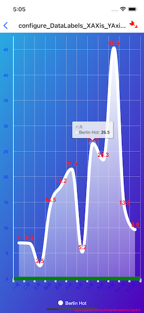
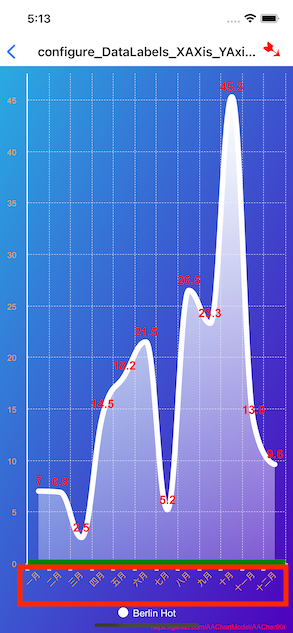

# AAChartKit使用

[AAChartKit](https://github.com/AAChartModel/AAChartKit)是一个开源的图标库，项目中用到了这库，所以记录下使用过程以及遇到的问题

## 基本
基本使用方式参考官方文档说明
1.创建`AAChartView`
2.创建模型`AAChartModel`
3.绘制

```objectivec
/*图表视图对象调用图表模型对象,绘制最终图形*/
[_aaChartView aa_drawChartWithChartModel:aaChartModel];
```

**刷新**
1.仅仅刷新图形的数据

```objectivec
/*仅仅更新 AAChartModel 对象的 series 属性时,动态刷新图表*/
[_aaChartView aa_onlyRefreshTheChartDataWithChartModelSeries:aaChartModelSeriesArray];
```

2.刷新图形除数据属性 `series` 以外的其他属性

```objectivec
/*更新 AAChartModel 内容之后,刷新图表*/
[_aaChartView aa_refreshChartWithChartModel:aaChartModel];
```

### 颜色
**1.`AARgbColor`**

可通过`AARgbColor`快速的生成颜色，如：

```objectivec
AARgbColor(128, 255, 165)
```


## 自定义设置
在开发过程中，需要自定义UI设置
### X轴、Y轴
**1.轴的显示或者隐藏**

```objectivec
AAPropSetFuncImplementation(AAChartModel, BOOL,       xAxisVisible) //X 轴是否可见(默认可见)
AAPropSetFuncImplementation(AAChartModel, BOOL,       yAxisVisible) //Y 轴是否可见(默认可见)
```

也可以通过轴线的宽度来控制显示or隐藏，如Y轴将宽度设置为0时，也不显示

```objectivec
AAPropSetFuncImplementation(AAChartModel, NSNumber *, yAxisLineWidth) //Y 轴的轴线宽度
```

**2.轴的样式**
比如要修改轴的颜色、宽度等，可使用`AAOptions`中的一些设置
参考官方例子中的`configure_DataLabels_XAXis_YAxis_Legend_Style`，如修改X轴：

```objectivec
    aaOptions.xAxis
    .tickWidthSet(@5)//X轴刻度线宽度
    .lineWidthSet(@10)//X轴轴线宽度
    .lineColorSet(AAColor.greenColor)//X轴轴线颜色
    .gridLineColorSet(AAColor.whiteColor)
    .gridLineWidthSet(@0.5)//X轴网格线宽度
    .gridLineDashStyleSet(AAChartLineDashStyleTypeDash)
    ;
```


**3.轴Label样式**
例如X轴，通过`AAChartModel`的`categoriesSet`设置，X轴label要显示的内容，可通过`AAChartModel`设置样式：

```objectivec
AAPropSetFuncImplementation(AAChartModel, AAStyle  *, xAxisLabelsStyle) //X 轴文字样式
AAPropSetFuncImplementation(AAChartModel, AAStyle  *, yAxisLabelsStyle) //Y 轴文字样式
```
如：

```objectivec
AAStyle *axisLabelsStyle = AAStyleColor(AAColor.orangeColor);

aaChartModel.xAxisLabelsStyleSet(axisLabelsStyle)
```

**4.网格线**

```objectivec
AAPropSetFuncImplementation(AAChartModel, AALineStyle *, xAxisGridLineStyle) //X 轴网格线的样式
AAPropSetFuncImplementation(AAChartModel, AALineStyle *, yAxisGridLineStyle) //Y 轴网格线的样式
```
如：

```objectivec
	AALineStyle *gridLineStyle = [AALineStyle styleWithWidth:@1];
......
    .xAxisGridLineStyleSet(gridLineStyle)
    .yAxisGridLineStyleSet(gridLineStyle)
```
如果将width设置为0，表示隐藏网格线
