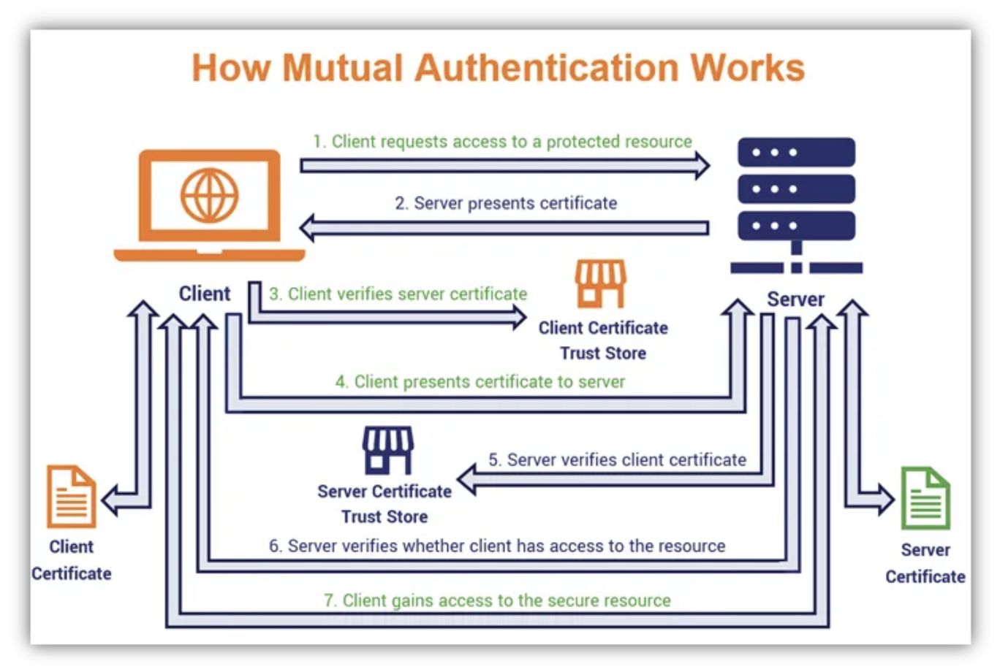

# NSURLAuthenticationMethodClientCertificate

关于客户端证书的处理，有个不错的例子：

+ [Client Certificate Handling on iOS](https://medium.com/nerd-for-tech/client-certificate-handling-on-ios-f704d896cccd)

从这个例子，也了解到一个网站，[badssl.com](https://github.com/chromium/badssl.com)

借用其一张图：

