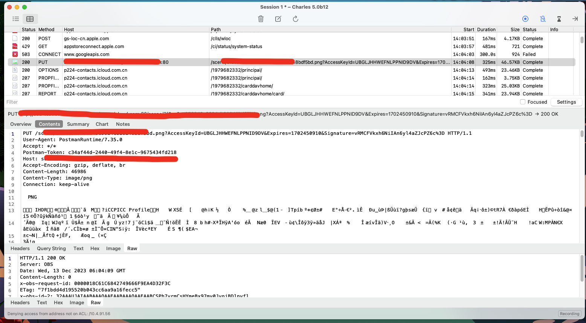

# PUT方式上传文件

以前遇到的项目上传大多数使用的是Post的`multipart/form-data`这种形式

使用华为的OBS上传数据，使用PUT方式，参考：

+ [PUT上传和POST上传有什么区别？](https://support.huaweicloud.com/obs_faq/obs_faq_0071.html)

我自己也抓了个包，上传一张图片，发现数据是直接放在请求体中的，如下：

